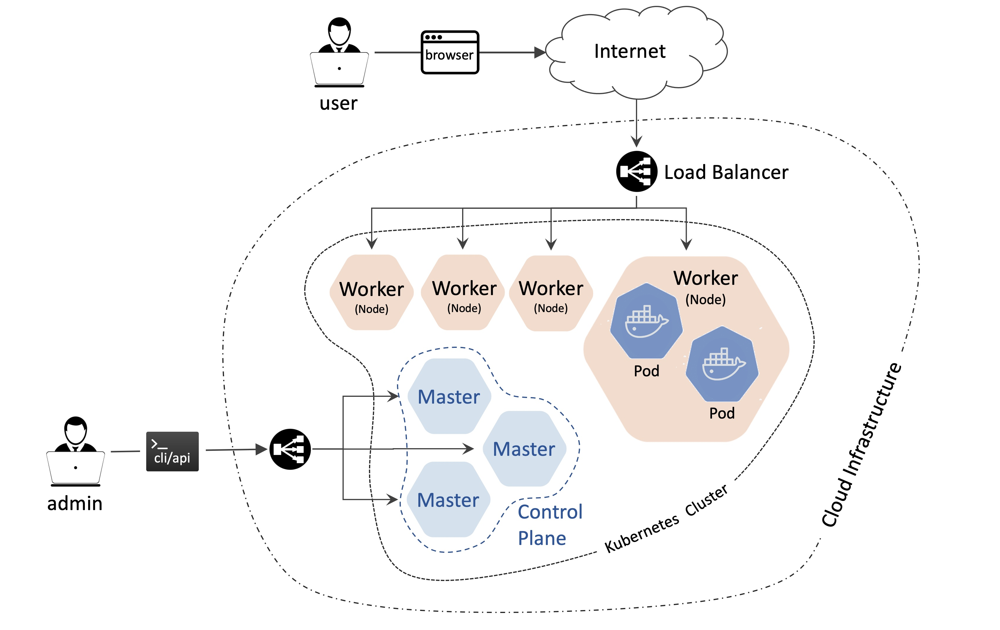

Kubernetes (also known as k8s) is an open-source system for automating deployment, scaling, and management of containerized applications.

It groups containers that make up an application into logical units for easy management and discovery. Kubernetes builds upon 15 years of experience of running production workloads at Google, combined with best-of-breed ideas and practices from the community.

[How k8s works](https://youtu.be/daVUONZqn88)

#### Kubernetes Infrastructure

**Kubernetes cluster is running across servers. There’re several roles assigned to underlying servers:**

- **Master(s)** - responsible for maintaining the desired state for your cluster. When you interact with Kubernetes, such as by using the kubectl command-line interface, you’re communicating with your cluster’s Kubernetes master. The “master” refers to a collection of processes managing the cluster state

- **Node(s)/Worker(s)** - the machines (VMs, physical servers, etc) that run your applications and cloud workflows. The Kubernetes master controls each node; you’ll rarely interact with nodes directly.

### Working with Cluster
- Getting Cluster Info
`kubectl cluster-info`

- Getting Cluster members
`kubectl get nodes
kubectl get nodes -o wide`

Please investigate Kubernetes Infrastructure and answer questions below:

- Q1 Check kubectl cluster-info and find Kubernetes “control plane” entrypoint url
Text input

- Q2 How many servers are there in our cluster?

``kubectl get nodes``

- Q3 How many servers have master role assigned?
Text input

- Q4 How many servers have worker role assigned?
Text input

- Q5 What is the IP address of master node?
Text input

- Q6 What is the IP address of node01 node?
Text input
