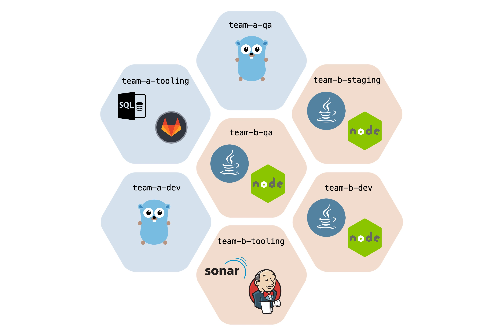

Kubernetes supports multiple virtual clusters backed by the same physical cluster. These virtual clusters are called **Namespaces**.

Namespaces provide a scope for names. Names of resources need to be unique within a namespace, but not across namespaces. Namespaces can not be nested inside one another and each Kubernetes resource can only be in one namespace.

- Namespaces divide cluster resources logically
- Nodes are VMs

There’s no need to use multiple namespaces - just to separate slightly different resources, such as different versions of the same software: use labels to distinguish resources within the same namespace.

Kubernetes starts with 4 initial namespaces:

- **default** - The default namespace for objects with no other namespace

- **kube-system** - The namespace for objects created by the Kubernetes system

- **kube-public** - This namespace is created automatically and can be read by all users (including those not authenticated). This namespace is mostly reserved for cluster usage, in case that some resources should be visible and readable publicly throughout the whole cluster. The public aspect of this namespace is only a convention, not a requirement.

- **kube-node-lease** - This namespace holds Lease objects associated with each node. Node leases allow the kubelet to send heartbeats so that the control plane can detect node failure.

Working with most of the resources in Kubernetes requires providing namespace name explicitly:

``kubectl get pods -n kube-system``

#### Working with Namespaces

**Viewing Namespaces:**
`` kubectl get namespaces``

``kubectl get namespaces --show-labels``

**Viewing Resources in Namespace:**

```shell
### For default Namespace:
kubectl get pods
kubectl get deployment

## Working with other namespaces:
kubectl get pods -n ${NS_NAME}
kubectl get rs -n ${NS_NAME}
kubectl get all -n ${NS_NAME}

## Getting Pods from All Namespaces:
kubectl get pods -A
kubectl get pods --all-namespaces
```

#### Documentation:

https://kubernetes.io/docs/concepts/overview/working-with-objects/namespaces/

**Please answer the following question:**
- Q1 How many namespaces are currently created in the cluster?

`` kubectl get ns``

- Q2 How many resources (all) are created in kube-system namespace?

``kubectl get all -n kube-system ``

- Q3 Check the labels and find “what namespace Santa doesn’t like”

``kubectl get ns --show-labels``

- Q4 What Pod is running in “red” namespace?

``kubectl get pod -n red``

- Q5 What “rs” (Replica Set) is running in “red” namespace?

``kubectl get rs -n red``
