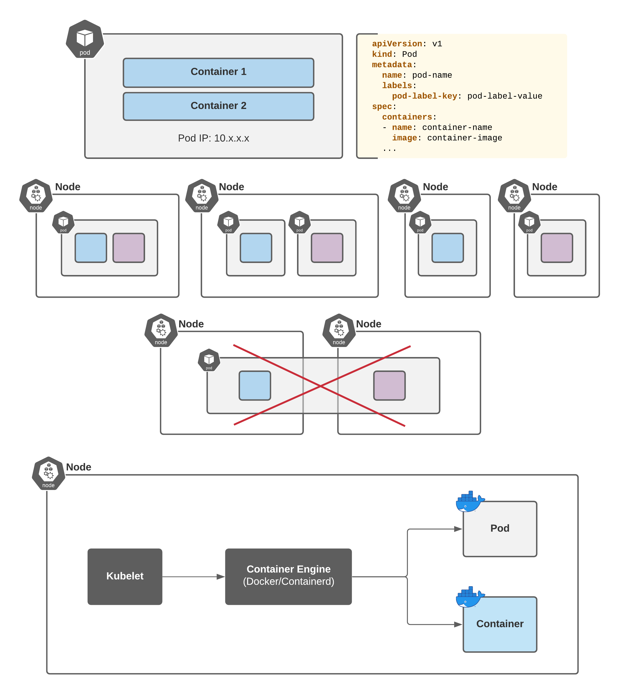

### 4. Pods

A Kubernetes Pod is a group of containers with shared storage, network, and cgroup that are always scheduled to run on the same node. A pod is also the the smallest deployable unit of compute that can be created and managed by Kubernetes.




### Pod Manifest Example:
```yaml
apiVersion: v1
kind: Pod
metadata:
  name: myapp-pod
  labels:
    app: myapp
spec:
  containers:
  - name: myapp-container
    image: busybox
    command: ['sh', '-c', 'echo Hello Kubernetes! && sleep 3600']
```
**Working with Pods:**
```shell
kubectl get po
kubectl get pod
kubectl get pods
kubectl get pods --all-namespaces
kubectl get pods -A
kubectl get pods -n ${NS_NAME}
kubectl get pods ${POD_NAME}
kubectl get pods ${POD_NAME} -n ${NS_NAME}
kubectl get pods ${POD_NAME} -o yaml
kubectl get pods ${POD_NAME} -o wide

kubectl describe pods ${POD_NAME} 
kubectl describe pods ${POD_NAME} -n ${NS_NAME} 

kubectl apply -f pod-manifest.yaml
kubectl delete -f pod-manifest.yaml

kubectl run ${POD_NAME} [-n ${NS_NAME}] --image=${POD_IMAGE}
kubectl run ${POD_NAME} [-n ${NS_NAME}] --image=${POD_IMAGE} -- {command}
kubectl run ${POD_NAME} [-n ${NS_NAME}] --image=${POD_IMAGE} --command {command}
```

Documentation
https://kubernetes.io/docs/concepts/workloads/pods/

### Please answer the questions below:

- Q1 How many PODs exist in “default” namespace?

    ``kubectl get pod -n default``

- Q2 How many PODs exist in “all” namespaces?

    ``kubectl get pod --all-namespaces``
- Q3 How many PODs exist in “customer” namespace?

    ``kubectl get pods -n customer``


### 5. Pods
You might probably looking for the details like where the pod is running on (node name), pod ip address, its containers and images, pod status details and so on


### Investigating Pod’s details:
```shell
kubectl get pods [-n ${NS_NAME}]
kubectl get pods ${POD_NAME} [-n ${NS_NAME}]
kubectl get pods ${POD_NAME} [--all-namespaces]
kubectl get pods ${POD_NAME} -o yaml
kubectl get pods ${POD_NAME} -o wide

kubectl describe pods ${POD_NAME} 
kubectl describe pods ${POD_NAME} [-n ${NS_NAME}]
```

#### Documentation

https://kubernetes.io/docs/concepts/workloads/pods/

### Task:

**A pod has just been created. Find it by creation time. Investgate its details and answer the quiz below**

**Quiz:**

- Q1 What is the name of nearly created Pod?
- ``kubectl get pods -o wide``

- Q2 Choose the image used for creating this pod
    ``kubectl get pods newpod -o yaml``

- Q3 Where is this pod running? Find Node Name
    ``kubectl get pods newpod -o wide``


### 6. Pods


### Working with Pods:

```shell
kubectl get po ${POD_NAME} -o yaml
kubectl describe po ${POD_NAME}
```

### Task:

We’ve just created stranger POD. Ignore the state of the POD for now. Please look into its detail and answer questions below:

### Quiz:
- Q1 How many containers does the Pod stranger have?

    ``kubectl describe pod stranger``

- Q2 What images are used in the new stranger pod?

    ``kubectl describe pod stranger | grep Image:``

- Q3 What are the names of these containers?

    billy & bobby

