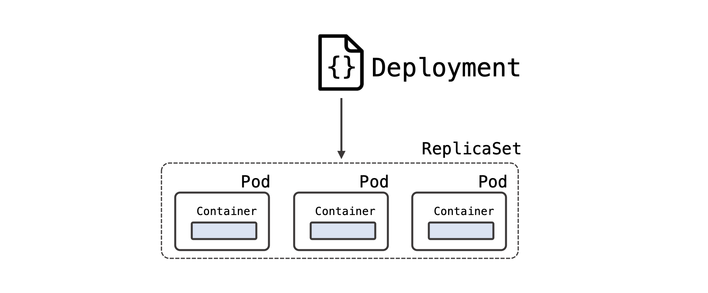
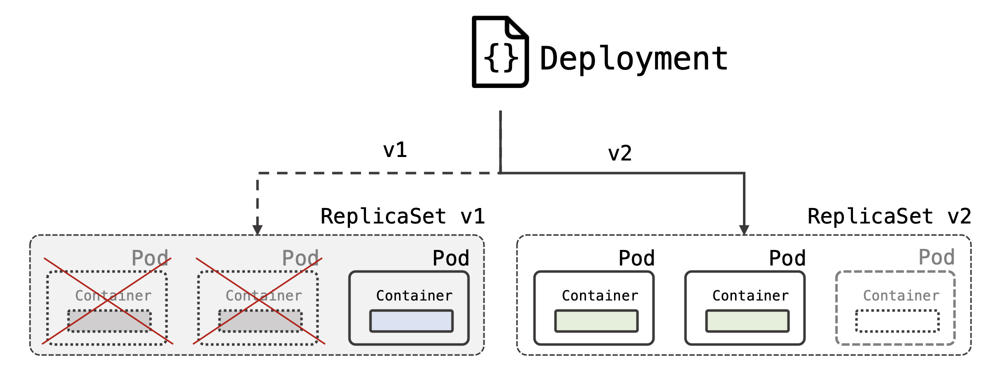

A Kubernetes **deployment** manages scheduling and lifecycle of pods. Deployments provide several key features for managing pods, including rolling out pods updates, rolling back, and easily scaling pods horizontally.




**Useful Commands:**
```shell
kubectl apply -f deployment.yaml
kubectl get deploy
kubectl get deploy --show-labels
kubectl get deploy -n ${NS_NAME}
kubectl get deploy -o yaml
kubectl describe deploy -n ${NS_NAME}
kubectl delete deploy ${NS_NAME}
```

**Deployment Manifest Example:**

```yaml
apiVersion: apps/v1
kind: Deployment
metadata:
  name: nginx-deployment
  labels:
    app: nginx
spec:
  replicas: 3
  selector:
    matchLabels:
      app: nginx
  template:
    metadata:
      labels:
        app: nginx
    spec:
      containers:
      - name: nginx
        image: nginx:1.7.9
        ports:
        - containerPort: 80
```
```yaml
apiVersion: apps/v1
kind: Deployment
metadata:
  namespace: ppl
  labels:
    app: crowd-app
  name: crowd
spec:
  replicas: 20
  selector:
    matchLabels:
      app: crowd-app
  template:
    metadata:
      labels:
        app: crowd-app
    spec:
      containers:
      - name: pause
        image: rancher/pause:3.1
```
**Documentation:**
https://kubernetes.io/docs/concepts/workloads/controllers/deployment/

#### Please explore simians namespace and answer the following questions:

- Q1 How many Pods exist in the simians namespace?

    ``kubectl get pods -n simians``

- Q2 How many ReplicaSets exist in the simians namespace?

    ``kubectl get rs -n simians``

- Q3 How many Deployments exist in the simians namespace?
    ``kubectl get deploy -n simians``

- Q4 What is the image is used for creating pods by deployment?

    ``kubectl describe deployments.apps -n simians``

- Q5 Why do you think the deployment is not ready?
    The image doesn’t exist


### 13. Deployment

**Task:**
Let’s try to fix our deployment.

You can find its manifest in the file /opt/practice/monkeys.yaml. Please find and fix all incorrent configurations, add necessary details if it’s required. And redeploy.

 Wait until all pods become *“Running*”


Verification:
```shell
kubectl get deploy,pods -n simians 
NAME                                READY   UP-TO-DATE   AVAILABLE   AGE
deployment.extensions/crazymonkey   12/12   12           12          30m

NAME                               READY   STATUS    RESTARTS   AGE
pod/crazymonkey-6c57fcb44b-2d7wv   1/1     Running   0          82s
pod/crazymonkey-6c57fcb44b-2gg9z   1/1     Running   0          76s
pod/crazymonkey-6c57fcb44b-6s7hj   1/1     Running   0          82s
pod/crazymonkey-6c57fcb44b-9qd8f   1/1     Running   0          82s
pod/crazymonkey-6c57fcb44b-cn2nz   1/1     Running   0          78s
pod/crazymonkey-6c57fcb44b-ffc2q   1/1     Running   0          78s
pod/crazymonkey-6c57fcb44b-gpqh4   1/1     Running   0          79s
pod/crazymonkey-6c57fcb44b-jtjdk   1/1     Running   0          82s
pod/crazymonkey-6c57fcb44b-ptklz   1/1     Running   0          82s
pod/crazymonkey-6c57fcb44b-skhdc   1/1     Running   0          82s
pod/crazymonkey-6c57fcb44b-tkf2l   1/1     Running   0          77s
pod/crazymonkey-6c57fcb44b-v9444   1/1     Running   0          77s
```s