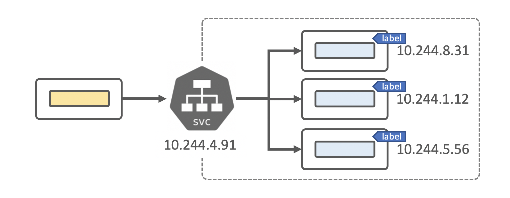
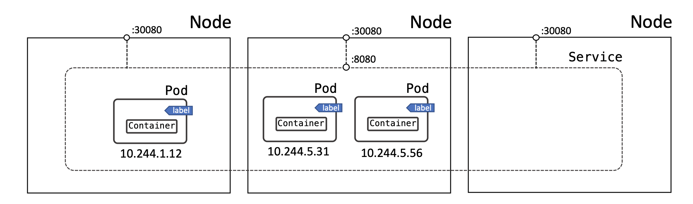

### Service (SVC)


Kubernetes Pods are mortal. They are born and when they die, they are not resurrected. If you use a Deployment to run your app, it can create and destroy Pods dynamically.

Each Pod gets its own IP address, however in a Deployment, the set of Pods running in at the moment in time could be different from the set of Pods running that application a moment later.

*Service aggregates pods at backend and acts as a LoadBalancer. It’s a single point for all pods behing (it makes no sense to aggregate different applications, we use it only for multiple replicas of the same application). I has own IP Address (type: ClusterIP, if it’s not headless - type: None), DNS Name (available inside cluster). Also, service is used as a mean for exposing Pod’s Port to Node’s Port (type: NodePort). In Clouds service can initiate creating of Cloud LoadBalancer in order to route traffic from Cloud Infrastructure inside Kubernetes Cluster (type: LoadBalancer)*

**Example of the Service:**
```yaml
apiVersion: v1
kind: Service
metadata:
  name: service-name
spec:
  selector:
    app: << set the same label as deployment has >>
  ports:
    - protocol: TCP
      # Incoming Port on the Service
      port: 80
      # Incoming Port on Pod(s)
      targetPort: 8080
```
**Task:**

- Deploy pod-info application from /opt/practice/pod-info-application.yaml file
- Deploy pod-info-svc service from the snippet above (configure appropriate label).

**Validation:**
Checking if svc has own IP

```shell
kubectl get svc pod-info-svc
NAME           TYPE        CLUSTER-IP      EXTERNAL-IP   PORT(S)   AGE
pod-info-svc   ClusterIP   10.102.161.86   <none>        80/TCP    13s
```
**Checking if our svc (ep) has discovered backends**

```shell
kubectl describe ep pod-info-svc
Name:         pod-info-svc
Namespace:    default
Labels:       <none>
Annotations:  endpoints.kubernetes.io/last-change-trigger-time: 2020-12-28T22:36:25Z
Subsets:
  Addresses:          10.244.0.59,10.244.0.60,10.244.0.61,10.244.0.62,10.244.0.63
  NotReadyAddresses:  <none>
  Ports:
    Name     Port  Protocol
    ----     ----  --------
    <unset>  80    TCP
```
**Or simply this:**

```shell
kubectl get ep pod-info-svc -o jsonpath='{.subsets[*].addresses[*].ip}'
10.244.0.59 10.244.0.60 10.244.0.61 10.244.0.62 10.244.0.63
```
**To check what addresses our pods have (note: we use the same selector as svc):**

```shell
kubectl get pods -l app=pod-info -o wide
NAME                       READY   STATUS    RESTARTS   AGE  IP            NODE     NOMINATED NODE   READINESS GATES
pod-info-547479747-tgwhf   1/1     Running   0          1m   10.244.0.59   master   <none>           <none>
pod-info-547479747-qtqph   1/1     Running   0          1m   10.244.0.60   master   <none>           <none>
pod-info-547479747-fb65d   1/1     Running   0          1m   10.244.0.61   master   <none>           <none>
pod-info-547479747-cqfc9   1/1     Running   0          1m   10.244.0.62   master   <none>           <none>
pod-info-547479747-z8hjz   1/1     Running   0          1m   10.244.0.63   master   <none>           <none>
```

**Sollution**
- Deploy pod-info application from /opt/practice/pod-info-application.yaml file
```yaml
apiVersion: apps/v1
kind: Deployment
metadata:
  name: pod-info
  labels:
    app: pod-info
spec:
  replicas: 5
  selector:
    matchLabels:
      app: pod-info
  template:
    metadata:
      labels:
        app: pod-info
    spec:
      containers:
      - name: main
        image: sbeliakou/web-pod-info
        ports:
        - name: http
          containerPort: 80
```

- Deploy pod-info-svc service from the snippet above (configure appropriate label).
```yaml
apiVersion: v1
kind: Service
metadata:
  name: pod-info-svc
spec:
  selector:
    app: pod-info
  ports:
    - protocol: TCP
      # Incoming Port on the Service
      port: 80
      # Incoming Port on Pod(s)
      targetPort: 8080
```
**Documentation**

- https://kubernetes.io/docs/concepts/services-networking/service/
- https://kubernetes.io/docs/concepts/services-networking/connect-applications-service/


### 15. Service Types



For some parts of your application (for example, frontends) you may want to expose a Service onto an external IP address, that’s outside of your cluster.

Kubernetes ServiceTypes allow you to specify what kind of Service you want. The default is ClusterIP.

Type values and their behaviors are:

- **ClusterIP**: Exposes the Service on a cluster-internal IP. This is the default ServiceType.
- **NodePort:** Exposes the Service on each Node’s IP at a static port (the NodePort).
- **LoadBalancer:** Exposes the Service externally using a CLOUD provider’s load balancer.

**Task:**

Expose “book” Deployment to NodePort

Example definition:

```yaml
apiVersion: v1
kind: Service
metadata:
  name: << svc-name >>
spec:
  ports:
  - nodePort: << node port >>
    port: << svc port >>
    protocol: TCP
    targetPort: << pod port >>
  selector:
    << selecting rules >>
  type: NodePort
```

**Requirements:**

- Svc Name: book-nodeport-30080-svc
- Svc Type: NodePort
- Node Port: 30080
- Target Port: 8080
- Selector: app=book
**Verify**

Use browser Button or terminal console:
```shell
$ curl -sIL master:30080 | grep HTTP
HTTP/1.1 200 OK

$ curl -sIL node01:30080 | grep HTTP
HTTP/1.1 200 OK

$ curl -sIL node02:30080 | grep HTTP
HTTP/1.1 200 OK
```

**Sollution**
```yaml
apiVersion: v1
kind: Service
metadata:
  name: book-nodeport-30080-svc
spec:
  type: NodePort
  selector:
    app: book
  ports:
      # By default and for convenience, the `targetPort` is set to the same value as the `port` field.
    - port: 80
      targetPort: 8080
      # Optional field
      # By default and for convenience, the Kubernetes control plane will allocate a port from a range (default: 3
0000-32767)
      nodePort: 30080
```

**Documentation**
- https://kubernetes.io/docs/concepts/services-networking/service/#publishing-services-service-types
- https://kubernetes.io/docs/concepts/services-networking/connect-applications-service/
