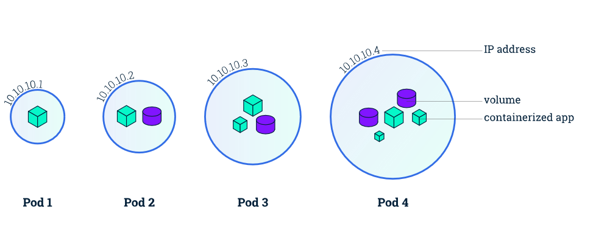

### 1. Pod

Pods are the smallest, most basic deployable objects in Kubernetes. A Pod represents a single instance of a running process in your cluster.

You can consider a Pod to be a self-contained, isolated “logical host” that contains the systemic needs of the application it serves.

**Pods** contain one or more containers, such as Docker containers. When a Pod runs multiple containers, the containers are managed as a single entity and share the Pod’s resources. Generally, running multiple containers in a single Pod is an advanced use case.

Pods also contain shared networking and storage resources for their containers:

- **Network:** Pods are automatically assigned unique IP addresses. Pod containers share the same network namespace, including IP address and network ports. Containers in a Pod communicate with each other inside the Pod on localhost.
- **Storage:** Pods can specify a set of shared storage volumes that can be shared among the containers.
Pods run on nodes in your cluster. Once created, a Pod remains on its node until its process is complete, the Pod is deleted, the Pod is evicted from the node due to lack of resources, or the node fails. If a node fails, Pods on the node are automatically scheduled for deletion.

Pods are ephemeral. They are not designed to run forever, and when a Pod is terminated it cannot be brought back. In general, Pods do not disappear until they are deleted by a user or by a controller.

Pods do not “heal” or repair themselves. For example, if a Pod is scheduled on a node which later fails, the Pod is deleted. Similarly, if a Pod is evicted from a node for any reason, the Pod does not replace itself.

True/False Game
Q1 A Pod is mortal
true
false
Q2 A Pod can have only one container
true
false
Q3 A Pod always shares own filesystem with the containers inside it
true
false
Q4 A Pod hosts containers in own network namespace
true
false
Q5 A Pod can have multiple containers which can run on different hosts
true
false

