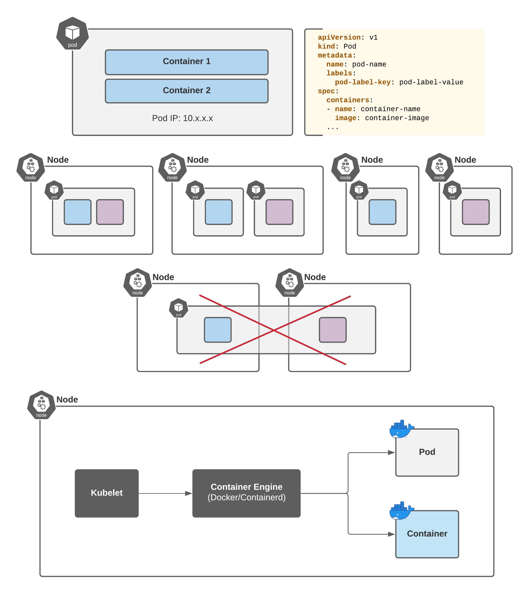

### 2. Creating a Simple Pod



**Container:** Resides inside a pod and is the lowest level of a microservice which holds the running application, the libraries, and their dependencies.

**Pod:** The basic scheduling unit in Kubernetes, a pod consists of a group of one or more containers deployed to a single node. All containers in a pod share an IP address, IPC, hostname, and other resources. Pods abstract network and storage away from the underlying container, allowing you to move containers around the cluster easily.

**Pod Manifest Example:**
```yaml
apiVersion: v1
kind: Pod
metadata:
  name: httpd-webserver-pod
  namespace: qa
  labels:
    env: test
    app: httpd
spec:
  containers:
  - name: webserver
    image: httpd:2.4.64-alpine
    imagePullPolicy: Always
    ports:
    - { name: http,  containerPort: 80 }
    - { name: https, containerPort: 443 }
```
**Task:**

You should create a pod by following requirements:

- Pod name: nginx-pod
- Pod image: nginx:alpine
- Pod label: app=nginx
- Namespace: default
- Container Port: 80
 
**Wait till this pod comes into Running state**

**Verify:**
# Checking Pod status
```shell
kubectl get pod nginx-pod 
NAME        READY   STATUS    RESTARTS   AGE
nginx-pod   1/1     Running   0          30s

## Checking Image
kubectl describe pod nginx-pod | grep Image:
    Image:          nginx:alpine

kubectl get pod nginx-pod -o jsonpath='{.spec.containers[*].image}'
nginx:alpine

kubectl get pod nginx-pod \
    -o custom-columns='POD_NAME:metadata.name,IMAGE_NAME:spec.containers[*].image'
POD_NAME   IMAGE_NAME
nginx-pod  nginx:alpine

## Checking Labels
kubectl get pod nginx-pod --show-labels 
NAME        READY   STATUS    RESTARTS   AGE     LABELS
nginx-pod   1/1     Running   0          3m14s   app=nginx

## Checking Ports
kubectl get pod nginx-pod -o jsonpath='{.spec.containers[*].ports}'
[{"containerPort":80,"protocol":"TCP"}]
```
**Sollution**
```yaml
apiVersion: v1
kind: Pod
metadata:
  name: nginx-pod
  namespace: default
  labels:
    app: nginx
spec:
  containers:
  - name: nginx-container
    image: nginx:alpine
    imagePullPolicy: Always
    ports:
    - name: http-port
      containerPort: 80
```

**Documentation:**

- https://kubernetes.io/docs/concepts/workloads/pods/pod/
- https://kubernetes.io/docs/concepts/workloads/pods/pod-overview/#pod-templates
- https://kubernetes.io/docs/concepts/services-networking/connect-applications-service/
