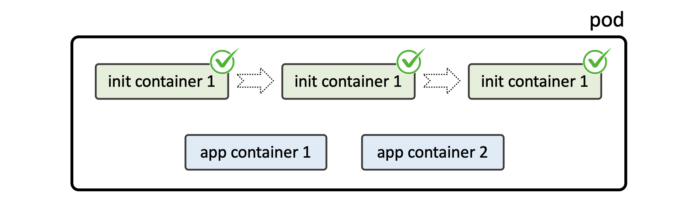

### 3. Init Containers




A Pod can have multiple containers running apps within it, but it can also have one or more init containers, which are run before the app containers are started.

We use init containers for running some stuff before main container starts.

Init containers are exactly like regular containers, except:

Init containers always run to completion.
Each init container must complete successfully before the next one starts.

```yaml
apiVersion: v1
kind: Pod
metadata:
  name: pod
spec:
  restartPolicy: Never
  initContainers:
  - name: init-container-1
    image: ...
    ...
  - name: init-container-2
    ...
  - name: init-container-3
    ...
  containers:
  - name: app-container-1
    image: ...
    ...
  - name: app-container-2
    ...
```


If a Pod’s init container fails, Kubernetes repeatedly restarts the Pod until the init container succeeds. However, if the Pod has a restartPolicy of Never, Kubernetes does not restart the Pod.

**Documentation**
- https://kubernetes.io/docs/concepts/workloads/pods/init-containers/
- https://kubernetes.io/docs/concepts/workloads/pods/pod-lifecycle/#restart-policy

**Task:**

There’s wonderland namespace. Please find a pod with initContainer.
    ``moc-turtle-b77d5466f-ztnb3``
- Q1 There’s “wonderland” namespace. Please find a pod with initContainer.
    ``kubectl get pod -n wonderland -o wide``
- Q2 What is the name of this initContainer?
    quickone
- Q3 What is its IP address?
    ``10.42.2.4``

**Sollution**
`kubectl get pod -n wonderland -o wide`