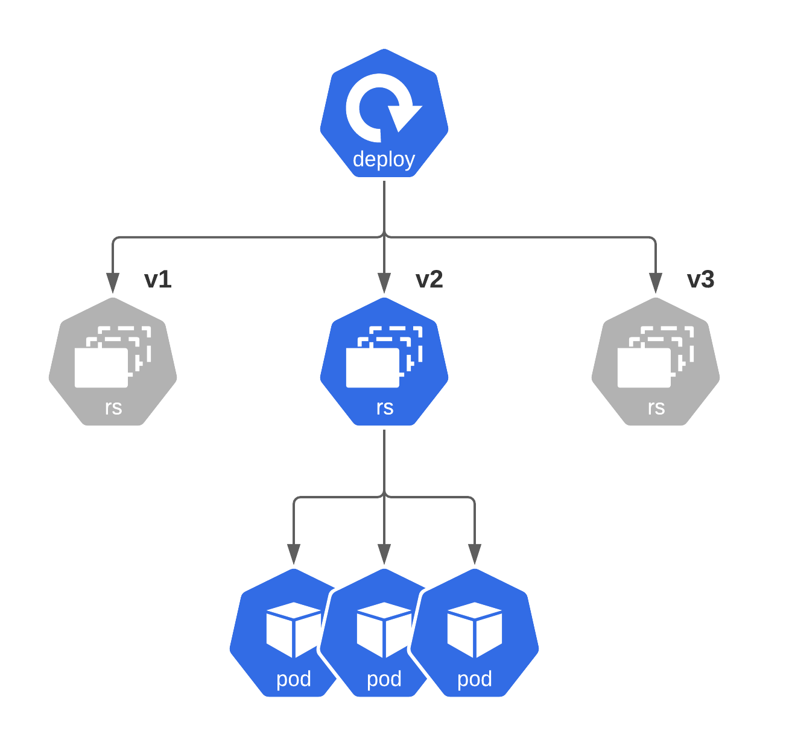

1. What is a Deployment?
Deployments represent a set of multiple, identical Pods with no unique identities. A Deployment runs multiple replicas of your application and automatically replaces any instances that fail or become unresponsive. In this way, Deployments help ensure that one or more instances of your application are available to serve user requests. Deployments are managed by the Kubernetes Deployment controller.

Deployments use a Pod template, which contains a specification for its Pods. The Pod specification determines how each Pod should look like: what applications should run inside its containers, which volumes the Pods should mount, its labels, and more.

When a Deployment’s Pod template is changed, new Pods are automatically created one at a time.


https://youtu.be/HPutXDwSWM0

The deployment is (simply) responsible for rolling out your application, looking after its updates and rolling back to previous state - if needed. This is achieved because “Deployment” creates corresponding “Replicaset” per each deployment object:



- Q1 What Deployment is currently running in milky-way namespace

    `kubectl get deployments.apps -n milky-way`

- Q2 How many replicaSets does this Deployment have right now?

    `kubectl get rs -n milky-way`

- Q3 What is Its currently active ReplicaSet Name?

    `kubectl get rs -n milky-way`

- Q4 Which image is used by the Application now (get rs -o wide)?

    `kubectl get rs solar-dd97d5f88 -o wide -n milky-way`


### 2. Creating Deployment

**Example of Deployment Manifest:**

```yaml
apiVersion: apps/v1
kind: Deployment
metadata:
  name: nginx-deployment
  labels:
    app: nginx
spec:
  replicas: 3
  selector:
    matchLabels:
      app: nginx
  template:
    metadata:
      labels:
        app: nginx
    spec:
      containers:
      - name: nginx
        image: nginx:1.7.9
        ports:
        - containerPort: 80
```

**In this example:**

- A Deployment named `nginx` is created, indicated by the `.metadata.name` field.
- The Deployment creates three replicated Pods, indicated by the `replicas field.
- The Pod template, or `.spec.template` field, indicates that its Pods are labelled `app: nginx`.
- The Pod template’s specification, or `.spec.template.spec` field, indicates that the Pods run one container, nginx, which runs the `nginx` Docker Hub image at version 1.7.9.
- The Deployment opens port `80` for use by the Pods.

**Task:**

Create a new deployment called nginx-deploy

**Requirements:**

- Name: nginx-deploy
- Image: nginx:1.16-alpine
- Replicas: 1
- Labels:
    - app=nginx-deploy
- Make sure that pods are running

**Verify:**

```shell
kubectl get deploy -l app=nginx-deploy
NAME           READY   UP-TO-DATE   AVAILABLE   AGE
nginx-deploy   1/1     1            1           1m17s

kubectl get replicaset -l app=nginx-deploy
NAME                      DESIRED   CURRENT   READY   AGE
nginx-deploy-5db957f468   1         1         1       1m19s

kubectl get pod -l app=nginx-deploy
NAME                            READY   STATUS    RESTARTS   AGE
nginx-deploy-5db957f468-frj8w   1/1     Running   0          1m22s
```


**Sollution**

```yaml
apiVersion: apps/v1
kind: Deployment
metadata:
  name: nginx-deploy
  labels:
    app: nginx-deploy
spec:
  replicas: 1
  selector:
    matchLabels:
      app: nginx-deploy
  template:
    metadata:
      labels:
        app: nginx-deploy
    spec: 
      containers:
      - name: nginx
        image: nginx:1.16-alpine
        ports:
        - containerPort: 80
```

**Documentation:**

- https://kubernetes.io/docs/concepts/workloads/controllers/deployment/
- https://cloud.google.com/kubernetes-engine/docs/concepts/deployment

### 3. Creating Deployment. Quick Way

Please inspect following command:

`kubectl create deployment --help`


**Create a deployment with the specified name.**

Aliases:
deployment, deploy
```yaml
Examples:
  # Create a deployment named my-dep that runs the busybox image.
  kubectl create deployment my-dep --image=busybox
  
  # Create a deployment with command
  kubectl create deployment my-dep --image=busybox -- date
  
  # Create a deployment named my-dep that runs the nginx image with 3 replicas.
  kubectl create deployment my-dep --image=nginx --replicas=3
  
  # Create a deployment named my-dep that runs the busybox image and expose port 5701.
  kubectl create deployment my-dep --image=busybox --port=5701

Options:
      --allow-missing-template-keys=true: If true, ignore any errors in templates when a field or
map key is missing in the template. Only applies to golang and jsonpath output formats.
      --dry-run='none': Must be "none", "server", or "client". If client strategy, only print the
object that would be sent, without sending it. If server strategy, submit server-side request
without persisting the resource.
      --field-manager='kubectl-create': Name of the manager used to track field ownership.
      --image=[]: Image names to run.
  -o, --output='': Output format. One of:
json|yaml|name|go-template|go-template-file|template|templatefile|jsonpath|jsonpath-as-json|jsonpath-file.
      --port=-1: The port that this container exposes.
  -r, --replicas=1: Number of replicas to create. Default is 1.
      --save-config=false: If true, the configuration of current object will be saved in its
annotation. Otherwise, the annotation will be unchanged. This flag is useful when you want to
perform kubectl apply on this object in the future.
      --template='': Template string or path to template file to use when -o=go-template,
-o=go-template-file. The template format is golang templates
[http://golang.org/pkg/text/template/#pkg-overview].
      --validate=true: If true, use a schema to validate the input before sending it
```

**Usage:**
  `kubectl create deployment NAME --image=image -- [COMMAND] [args...] [options]`

Use "kubectl options" for a list of global command-line options (applies to all commands).

**Task:**

Inspect the details listed above, add necessary options to kubectl create deploy command to produce following deployment configuration:

- Name: easy-peasy
- Image: busybox:1.32
- Replicas: 5
- Command: sleep infinity

**Take into Account:**

To generate Deployment manifest you should use the same command with these options:

`--dry-run=client
-o yaml`

 Make sure you use these options before command part (-- ...)

**Sollution**

`kubectl create deployment easy-peasy --image=busybox:1.32 --replicas=5 -- sleep infinity`

**Documentation:**

- https://kubernetes.io/docs/concepts/workloads/controllers/deployment/
- https://cloud.google.com/kubernetes-engine/docs/concepts/deployment


### 4. Scaling Pods in Deployment

Ok, you have created nginx-deploy deployment with just 1 pod.

```shell
kubectl get pods
NAME                            READY   STATUS    RESTARTS   AGE
nginx-deploy-5db957f468-gj5d4   1/1     Running   0          23s
```
```yaml
kubectl scale --help
Set a new size for a Deployment, ReplicaSet, Replication Controller, or StatefulSet.

 Scale also allows users to specify one or more preconditions for the scale action.

 If --current-replicas or --resource-version is specified, it is validated before the scale is
attempted, and it is guaranteed that the precondition holds true when the scale is sent to the
server.

Examples:
  # Scale a replicaset named 'foo' to 3.
  kubectl scale --replicas=3 rs/foo
  
  # Scale a resource identified by type and name specified in "foo.yaml" to 3.
  kubectl scale --replicas=3 -f foo.yaml
  
  # If the deployment named mysql's current size is 2, scale mysql to 3.
  kubectl scale --current-replicas=2 --replicas=3 deployment/mysql
  
  # Scale multiple replication controllers.
  kubectl scale --replicas=5 rc/foo rc/bar rc/baz
  
  # Scale statefulset named 'web' to 3.
  kubectl scale --replicas=3 statefulset/web

Options:
      --all=false: Select all resources in the namespace of the specified resource types
      --allow-missing-template-keys=true: If true, ignore any errors in templates when a field or
map key is missing in the template. Only applies to golang and jsonpath output formats.
      --current-replicas=-1: Precondition for current size. Requires that the current size of the
resource match this value in order to scale.
      --dry-run='none': Must be "none", "server", or "client". If client strategy, only print the
object that would be sent, without sending it. If server strategy, submit server-side request
without persisting the resource.
  -f, --filename=[]: Filename, directory, or URL to files identifying the resource to set a new size
  -k, --kustomize='': Process the kustomization directory. This flag can't be used together with -f
or -R.
  -o, --output='': Output format. One of:
json|yaml|name|go-template|go-template-file|template|templatefile|jsonpath|jsonpath-as-json|jsonpath-file.
      --record=false: Record current kubectl command in the resource annotation. If set to false, do
not record the command. If set to true, record the command. If not set, default to updating the
existing annotation value only if one already exists.
  -R, --recursive=false: Process the directory used in -f, --filename recursively. Useful when you
want to manage related manifests organized within the same directory.
      --replicas=0: The new desired number of replicas. Required.
      --resource-version='': Precondition for resource version. Requires that the current resource
version match this value in order to scale.
  -l, --selector='': Selector (label query) to filter on, supports '=', '==', and '!='.(e.g. -l
key1=value1,key2=value2)
      --template='': Template string or path to template file to use when -o=go-template,
-o=go-template-file. The template format is golang templates
[http://golang.org/pkg/text/template/#pkg-overview].
      --timeout=0s: The length of time to wait before giving up on a scale operation, zero means
don't wait. Any other values should contain a corresponding time unit (e.g. 1s, 2m, 3h).

Usage:
  kubectl scale [--resource-version=version] [--current-replicas=count] --replicas=COUNT (-f
FILENAME | TYPE NAME) [options]

Use "kubectl options" for a list of global command-line options (applies to all commands).
```


Let’s try to scale it mmm… to 6 replicas.

**Task:**

Scale nginx-deploy deployment to 6 replicas

**Advice:**

There’re several ways to do it:

edit a file you used for creating the resource, and re-apply
kubectl edit deployment ...
kubectl scale ...
kubectl scale --help

**Verify:**

```shell
kubectl get pods
NAME                            READY   STATUS    RESTARTS   AGE
nginx-deploy-5db957f468-2s6gn   1/1     Running   0          21s
nginx-deploy-5db957f468-gj5d4   1/1     Running   0          2m25s
nginx-deploy-5db957f468-hd84d   1/1     Running   0          21s
nginx-deploy-5db957f468-m9w6n   1/1     Running   0          21s
nginx-deploy-5db957f468-qkwx5   1/1     Running   0          21s
nginx-deploy-5db957f468-sjzsp   1/1     Running   0          21s
```

**Documentation:**

- https://kubernetes.io/docs/reference/kubectl/cheatsheet/#scaling-resources
- https://kubernetes.io/docs/concepts/workloads/controllers/deployment/#scaling-a-deployment


kubectl create ns tomato

apiVersion: apps/v1
kind: Deployment
metadata:
  namespace: tomato
  labels:
    vegetable: tomato
  name: tomato
spec:
  replicas: 3
  selector:
    matchLabels:
      vegatable: tomato
  template:
    metadata:
      labels:
        vegatable: tomato
    spec:
      containers:
      - name: tomato      
        image: nginx:1.16-alpine
        ports:
        - containerPort: 8080