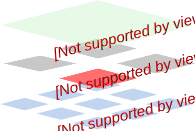

### Getting Familiar with Deployments

**We are going to dive deep into “Deployment” Kubernetes workload:**
- Creating Deployments
- Troubleshooting various issues with Deployments
- Getting familiar with how Kubernetes manages this workload

