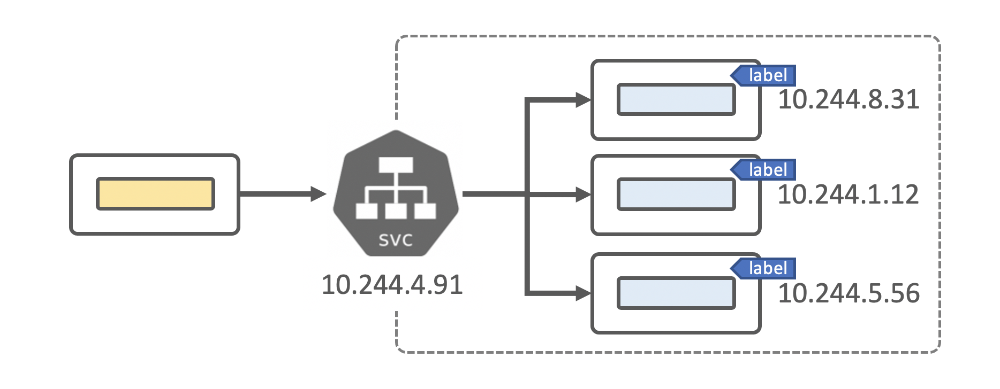
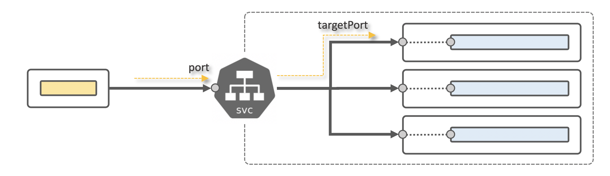
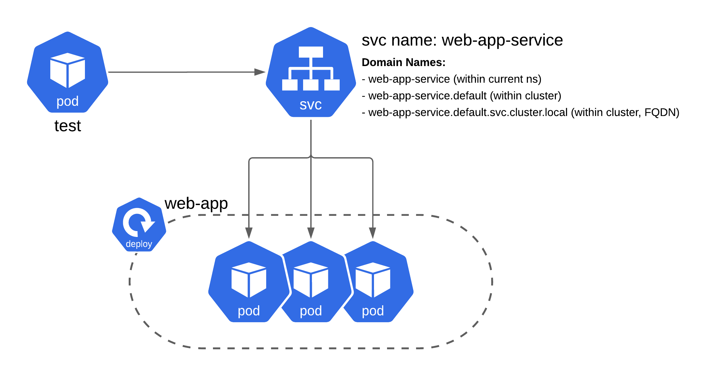

### 2. Service Type: ClusterIP
So, in Kubernetes Service is a set of pods that works together and are defined by a label selector, services decouple work definitions from the pods.

ClusterIP exposes the Service on a cluster-internal IP. Choosing this value makes the Service only reachable from within the cluster. This is the default ServiceType.



**Cluster IP**

Defines a logical set of pods and policy by which to access them

- it is an abstraction on top of the pods
- it uses selector to create a logical set of pods
- it gets stable Virtual IP and Port
- it is only available within K8s Cluster

**ClusterIP Explained:**

**Service Example:**

```yaml
apiVersion: v1
kind: Service
metadata:
  name: my-service
spec:
  selector:
    app: MyApp
  ports:
    - protocol: TCP
      port: 80
      targetPort: 9376
```

Here, service my-service has own ip address (ClusterIP, will be provided automatically) in Kuberenetes internal pod network, ready to get requests on port=80 and will downstream them to pods labeled app=MyApp to port 9376




**Task:**



- 1.Create pod-info-svc service for pod-info-app deployment

  - **Name:** pod-info-svc
  - **Type:** ClusterIP
  - **Service Port:** 80
  - **Service TargetPort:** 80
  - **Investigate** `pod-info-app` deployment and choose selector
  - **Do not change** `pod-info-app` deployment


- 2.Run a pod (based on image busybox:1.28) and execute following commands (as given below) inside this pod and save outputs into files on `client` host:

  - `wget -q -O- pod-info-svc save to /root/testing-clusterip-web.log (on client node!)`
  - `nslookup pod-info-svc save to /root/testing-clusterip-nslookup.log (on client node!)`

**Example:**

```shell# kubectl run test --image busybox:1.28 -i --tty --rm -- sh
If you don't see a command prompt, try pressing enter.

/ # nslookup pod-info-svc
Server:    10.96.0.10
Address 1: 10.96.0.10 kube-dns.kube-system.svc.cluster.local

Name:      pod-info-svc
Address 1: 10.101.149.153 pod-info-svc.default.svc.cluster.local

/ # wget -q -O- pod-info-svc
...
System Info:
  - Hostname: "pod-info-app-868c998896-lnwrr"
  - Address: "10.244.1.12"
  - System Time: "Sunday, 22-Nov-20 08:53:21 UTC"
  - System Up Time: "29.39s"
  - Run as User: "root(0:0)"
...

/# wget -q -O- pod-info-svc.default.svc.cluster.local
...
System Info:
  - Hostname: "pod-info-app-868c998896-lnwrr"
  - Address: "10.244.1.12"
  - System Time: "Sunday, 22-Nov-20 08:57:51 UTC"
  - System Up Time: "5m0.02s"
  - Run as User: "root(0:0)"
...

/ # exit
Session ended, resume using 'kubectl attach test -c test -i -t' command when the pod is running
pod "test" deleted
```

**Problems?**
- `nslookup` doesn’t work properly on busybox:latest?

```shell
Yes, it’s well-known bug. Use busybox:1.27 or busybox:1.28 (< 1.28.4)

$ kubectl run test --image busybox -i --rm -- nslookup pod-info-svc
If you don't see a command prompt, try pressing enter.
Server:         10.43.0.10
Address:        10.43.0.10:53

Name:   pod-info-svc.default.svc.cluster.local
Address: 10.43.188.3

*** Can't find pod-info-svc.svc.cluster.local: No answer
*** Can't find pod-info-svc.cluster.local: No answer
*** Can't find pod-info-svc.default.svc.cluster.local: No answer
*** Can't find pod-info-svc.svc.cluster.local: No answer
*** Can't find pod-info-svc.cluster.local: No answer

pod "test" deleted
```

- kubectl run ... stuck and didn’t show output?
```shell
Thought this should work, but it doesn’t:

$ kubectl run test --image busybox:1.28 -i --rm -- nslookup pod-info-svc
## long delay
pod "test" deleted
error: timed out waiting for the condition
Unfortunately yes, it should work, but it doesn’t do it for busybox images. Why? No idea.
But what to do?
Let’s try this:

$ echo nslookup pod-info-svc | kubectl run test --image busybox:1.27 -i --rm -- sh
```

**Service Domain Name**
Given you have service my-app-service created in my-app-ns namespace, you can reach it (internally, within cluster) by following names:


**Documentation:**
- https://kubernetes.io/docs/concepts/services-networking/service/
- https://kubernetes.io/docs/concepts/services-networking/service/#publishing-services-service-types
- https://dzone.com/articles/routing-external-traffic-into-your-kubernetes-serv
