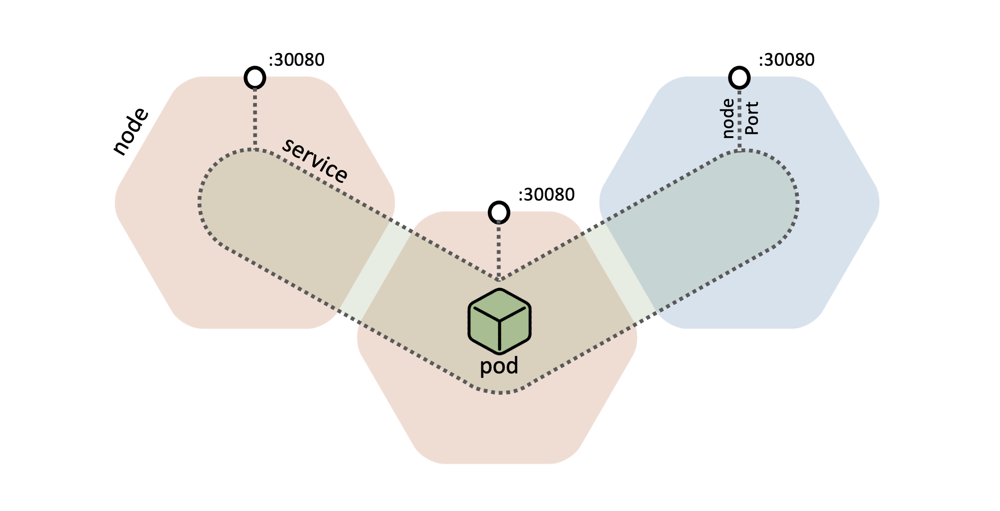
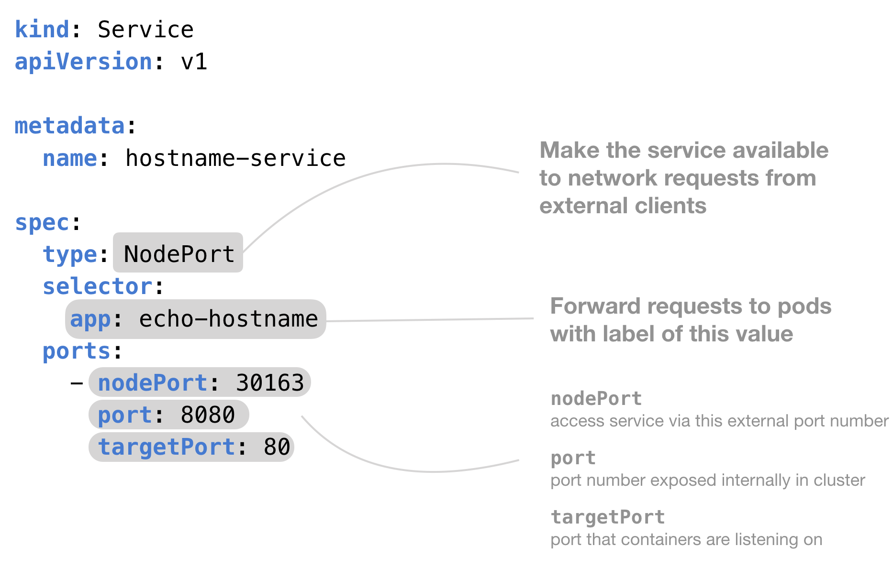

A Kubernetes nodePort service allows external traffic to be routed to the pods:


Brief Description:


**Task:**

- We have already created hello-hello web application for you.
- Create a new service to access this web application, check the requirements
- Figure out all necessary settings from the deployment

**Requirements:**

- Name: hello-hello-service
- Type: NodePort
- Downstream Pod Port (Service targetPort): 80

Here’s an example:



**Verification**

Once your service created, please find NodePort and simply run curl to all hosts of your custer as shown below:

```shell
kubectl get svc hello-hello-service 
NAME                  TYPE       CLUSTER-IP     EXTERNAL-IP   PORT(S)        AGE
hello-hello-service   NodePort   10.102.32.98   <none>        80:32123/TCP   22m

kubectl get ep hello-hello-service -o wide
NAME                  ENDPOINTS                                         AGE
hello-hello-service   10.244.0.9:80,10.244.1.27:80,10.244.1.28:80       22m
```

Checking that service is available on all hosts of our cluster by its NodePort:

```shell
$ curl -IL master:32123
HTTP/1.1 200 OK
Content-Type: text/plain
X-Owner: Siarhei Beliakou
X-Platform: Playpit Labs
Date: Tue, 29 Dec 2020 21:03:07 GMT
Content-Length: 1374

$ curl -IL node01:32123
HTTP/1.1 200 OK
Content-Type: text/plain
X-Owner: Siarhei Beliakou
X-Platform: Playpit Labs
Date: Tue, 29 Dec 2020 21:03:16 GMT
Content-Length: 1374

$ curl -IL node02:32123
HTTP/1.1 200 OK
Content-Type: text/plain
X-Owner: Siarhei Beliakou
X-Platform: Playpit Labs
Date: Tue, 29 Dec 2020 21:03:19 GMT
Content-Length: 1374
```

So, this basically means that you have enabled your application to be accessed from outside on every host of the cluster by the same (specific) port number

**Documentation:**
- https://kubernetes.io/docs/concepts/services-networking/service/#nodeport
- https://www.docker.com/blog/designing-your-first-application-kubernetes-communication-services-part3/

