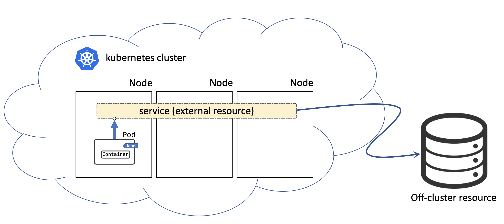

### 4. Service Type: ExternalName
Services of type ExternalName map a Service to a DNS name, not to a typical selector such as my-service or cassandra.




```yaml
apiVersion: v1
kind: Service
metadata:
  name: my-database
  namespace: prod
spec:
  type: ExternalName
  externalName: prod.database.example.com
```

Note: ExternalName accepts an IPv4 address string, but as a DNS names comprised of digits, not as an IP address. ExternalNames that resemble IPv4 addresses are not resolved by CoreDNS or ingress-nginx because ExternalName is intended to specify a canonical DNS name. To hardcode an IP address, consider using headless Services

**Task:**

Create ExternalName service:

- name: db
- externalName: prodb.a1b2c3d4wxyz.eu-west-1.rds.playpit.net

**Sollution**
```yaml
apiVersion: v1
kind: Service
metadata:
  name: db
spec:
  type: ExternalName
  externalName: prodb.a1b2c3d4wxyz.eu-west-1.rds.playpit.net
```


**Documentation:**

- https://kubernetes.io/docs/concepts/services-networking/service/#externalname
