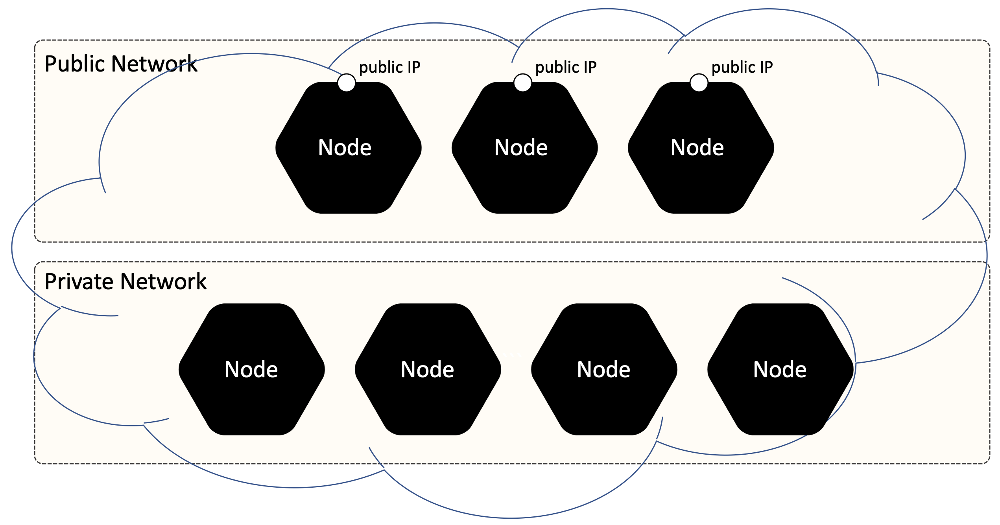

### 7. External IPs
If you have public IP Addresses assigned to (only) several cluster nodes, Kubernetes Services can be exposed on those externalIPs. Traffic that ingresses into the cluster with the external IP (as destination IP), on the Service port, will be routed to one of the Service endpoints. externalIPs are not managed by Kubernetes and are the responsibility of the cluster administrator.





In the Service spec, externalIPs can be specified along with any of the ServiceTypes. In the example below, “my-service” can be accessed by clients on “80.11.12.10:80” (externalIP:port)

```yaml
apiVersion: v1
kind: Service
metadata:
  name: my-service
spec:
  selector:
    app: MyApp
  ports:
    - name: http
      protocol: TCP
      port: 80
      targetPort: 9376
  externalIPs:
    - 80.11.12.10
    - 80.11.12.11
    - 80.11.12.12
```

**Task:**

An application called simple-web-app is running in the cluster.

Create ClusterIP Service and set externalIPs to master node (set its IP address):

- **Name:** my-web-service
- **Service Type:** ClusterIP
- **Service Port:** 80
- **Target Port:** 80
- **externalIPs:** find master node IP
 
**Please choose proper pod selector**

**Verification:**
```shell
kubectl get svc my-web-service
NAME             TYPE        CLUSTER-IP       EXTERNAL-IP      PORT(S)   AGE
my-web-service   ClusterIP   10.109.150.117   <<master ip>>    80/TCP    10s
```

Checking from client host (it’s from outside the cluster):

```shell
curl -I <<master ip>>
HTTP/1.1 200 OK
Server: nginx/1.19.0
Date: Sun, 21 Jun 2020 18:50:58 GMT
Content-Type: text/html
Content-Length: 612
Last-Modified: Tue, 26 May 2020 15:37:18 GMT
Connection: keep-alive
ETag: "5ecd37ae-264"
Accept-Ranges: bytes
```

**Port is published to master node, that's why this one fails**

```shell
curl -I <<node01 ip>>
curl: (7) Failed to connect to <<node01 ip>> port 80: Connection refused
 This means that our service is available on master node only and we didn’t use NodePort (which allocates service port on all nodes of the cluster!)
```

**Sollution**

```yaml
apiVersion: v1
kind: Service
metadata:
  name: my-web-service
spec:
  selector:
    app: simple-web-app
  ports:
    - name: http
      protocol: TCP
      port: 80
      targetPort: 80
  externalIPs:
  - 172.31.0.2
```

**Documantation:**

- https://kubernetes.io/docs/concepts/services-networking/service/#external-ips
