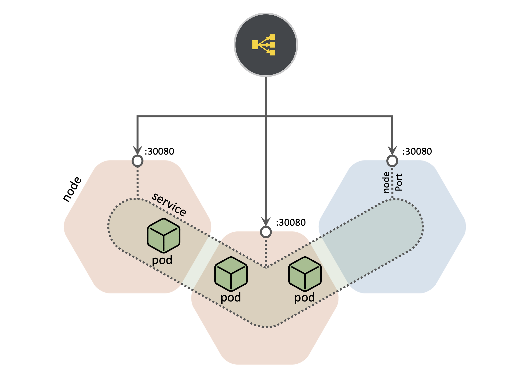

9. Service Type: LoadBalancer
On cloud providers which support external load balancers, setting the type field to LoadBalancer provisions a load balancer for your Service.



Brief Explanation:

https://youtu.be/xCsz9IOt-fs

**Example:**

On cloud providers which support external load balancers, setting the type field to LoadBalancer provisions a load balancer for your Service. The actual creation of the load balancer happens asynchronously, and information about the provisioned balancer is published in the Service’s `.status.loadBalancer` field. For example:
```yaml
apiVersion: v1
kind: Service
metadata:
  name: my-service
spec:
  selector:
    app: MyApp
  ports:
    - protocol: TCP
      port: 80
      targetPort: 9376
  clusterIP: 10.0.171.239
  type: LoadBalancer
status:
  loadBalancer:
    ingress:
    - ip: 192.0.2.127
```

Here, clusterIP: 10.0.171.239 and ip: 192.0.2.127 will be created automatically

**Task:**

We need to expose our application externally. DNS name will be assigned to this LB IP separately.

Please, follow the next action items:

Namespace: prod
Service Name: book-shelf-service
Product Name (deployment): book-shelf
Create a service with type LoadBalancer (IP address will be assinged automatically from platform managed pool)
Application Port - find it by checking pod logs
Verification:
$ kubectl get svc -n prod
NAME         TYPE           CLUSTER-IP     EXTERNAL-IP   PORT(S)        AGE
book-shelf   LoadBalancer   10.97.92.142   50.60.70.35   80:32419/TCP   8s

$ curl 50.60.70.35
Title: Winged Vortex
Author: James Martin

$ curl 50.60.70.35
Title: Day of Pluto
Author: Benjamin Anderson

$ curl 50.60.70.35
Title: Sirius Grieving
Author: Benjamin Harris

Documentation:
https://kubernetes.io/docs/concepts/services-networking/service/#loadbalancer
