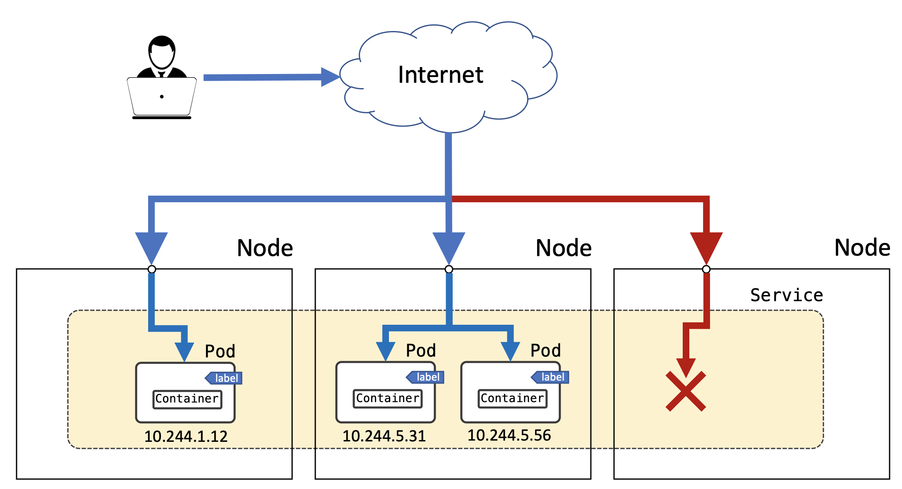
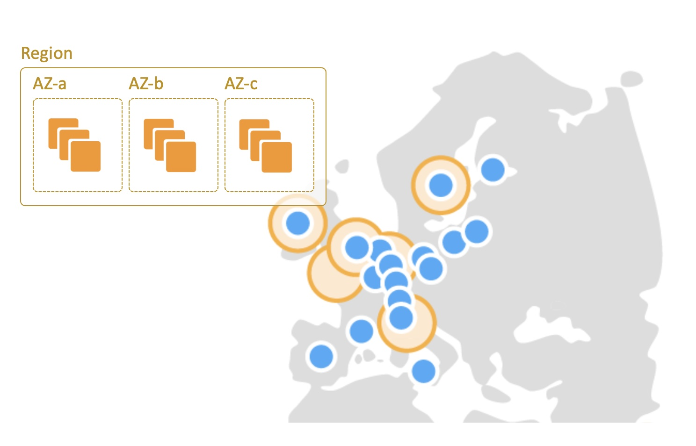

### 10. Service Topology
**Only Node Local Endpoints**
A Service that only routes to node local endpoints. If no endpoints exist on the node, traffic is dropped:



**Example:**

```yaml
apiVersion: v1
kind: Service
metadata:
  name: my-service
spec:
  selector:
    app: my-app
  ports:
    - protocol: TCP
      port: 80
      targetPort: 9376
  topologyKeys:
    - "kubernetes.io/hostname"
```

**Documentation:**
- https://kubernetes.io/docs/concepts/services-networking/service-topology/#only-node-local-endpoints

### 11. Service Topology



Only Zonal or Regional Endpoints
A Service that prefers zonal then regional endpoints. If no endpoints exist in either, traffic is dropped.

**Example:**
```yaml
apiVersion: v1
kind: Service
metadata:
  name: my-service
spec:
  selector:
    app: my-app
  ports:
    - protocol: TCP
      port: 80
      targetPort: 9376
  topologyKeys:
    - "topology.kubernetes.io/zone"
    - "topology.kubernetes.io/region"
```

**Documentation:**

- https://kubernetes.io/docs/concepts/services-networking/service-topology/#only-zonal-or-regional-endpoints
