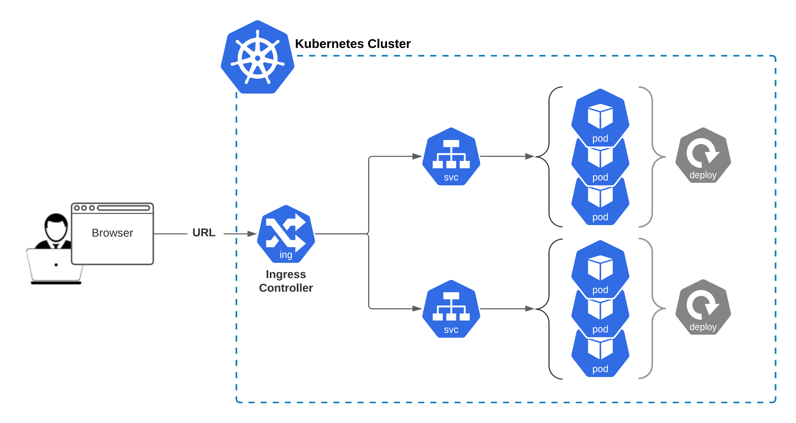

What is Ingress Controller?

The main problem it is solving is to provide single entrypoint to cluster applications (services) **by domain name(s)**.

Unlike other types of controllers which run as part of the kube-controller-manager binary, Ingress controllers are not started automatically with a cluster.

There are a lot of different implementations of [Ingress Controller](https://kubernetes.io/docs/concepts/services-networking/ingress-controllers/#additional-controllers). We have deployed one of the most simplest: `kubernetes/ingress-nginx` from https://github.com/kubernetes/ingress-nginx

**Technically, it’s an application stack of:**

- deployment
- service
- config maps
- etc

https://youtu.be/GhZi4DxaxxE

**Please find more details here: docs/deploy/**

If you browse the page http://k8slab.playpit.net you will find “404 Not Found” page, but it means that nothing is configured yet - there’re no routing/proxying rules created.

All of them are configured in `ingress-nginx` namespacpace

**Documentation:**
- https://kubernetes.io/docs/concepts/services-networking/ingress/
- https://cloud.google.com/kubernetes-engine/docs/concepts/ingress
- https://kubernetes.io/docs/concepts/services-networking/ingress-controllers/
- https://kubernetes.github.io/ingress-nginx/

**Let’s investigate rousorce(s) in ingress-nginx namespace and answer the questions below:**

Q1 What is ingress-controller’s deployment name?

Q2 What is ingress-controller’s service name?

Q3 What is the size of Replicas configured for it?

Q4 What is the version of nginx web server application it is based on (X.Y.Z)?

