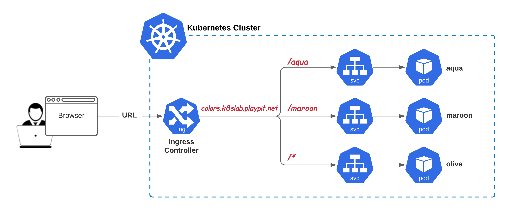

### 3. Ingress Resources. Path Backends



**Context Path Based Routing**

Imagine we have one domain name and we’d like to distribute microservices behind it. How to do this?

**Here’s an example of Ingress Resource**

**For k8s prior v1.19:**

```yaml
apiVersion: networking.k8s.io/v1beta1
kind: Ingress
metadata:
  name: simple-fanout-example
  annotations:
    nginx.ingress.kubernetes.io/rewrite-target: /
spec:
  rules:
  - host: foo.bar.baz.com
    http:
      paths:
      - path: /foo
        backend:
          serviceName: foo-service
          servicePort: 80
      - path: /bar
        backend:
          serviceName: bar-service
          servicePort: 8080
      - path:
        backend:
          serviceName: baz-service
          servicePort: 9090
```
**For k8s v1.19+:**

```yaml
apiVersion: networking.k8s.io/v1
kind: Ingress
metadata:
  name: simple-fanout-example
  annotations:
    nginx.ingress.kubernetes.io/rewrite-target: /
spec:
  rules:
  - host: foo.bar.baz.com
    http:
      paths:
      - path: /foo
        pathType: Prefix
        backend:
          service:
            name: foo-service
            port:
              number: 80
      - path: /bar
        pathType: Prefix
        backend:
          service:
            name: bar-service
            port:
              number: 8080
      - path: /
        pathType: Prefix
        backend:
          service:
            name: baz-service
            port:
              number: 9090
```              

**Task:**

Using the services you have created recently (in task #2), create **Ingress Resource** assuming that:

- **Ingress Resource Name:** `colors-ingress`
- **FQDN:** `colors.k8slab.playpit.net`
- **Context Paths:**
    `/aqua:` implements `aqua-svc` response
    `/maroon:` implements `maroon-svc` response
    `/*` (default, any other): implements `olive-svc` response

**Verification Details:**

- `colors.k8slab.playpit.net/aqua` responds with `aqua` page
- `colors.k8slab.playpit.net/maroon` responds with `maroon` page
- colors.k8slab.playpit.net/ responds with olive page
- colors.k8slab.playpit.net/blah-blah-blah responds with olive page


**Sollution**
```yaml
apiVersion: networking.k8s.io/v1
kind: Ingress
metadata:
  name: colors-ingress
  annotations:
    nginx.ingress.kubernetes.io/rewrite-target: /
spec:
  rules:
  - host: colors.k8slab.playpit.net 
    http:
      paths:
      - path: /aqua
        pathType: Prefix
        backend:
          service:
            name: aqua-svc
            port:
              number: 80
      - path: /maroon
        pathType: Prefix
        backend:
          service:
            name: maroon-svc
            port:
              number: 80
      - path: /
        pathType: Prefix
        backend:
          service:
            name: olive-svc
            port:
              number: 80
```

**Documentation:**

- https://kubernetes.io/docs/concepts/services-networking/ingress/
- https://cloud.google.com/kubernetes-engine/docs/concepts/ingress
