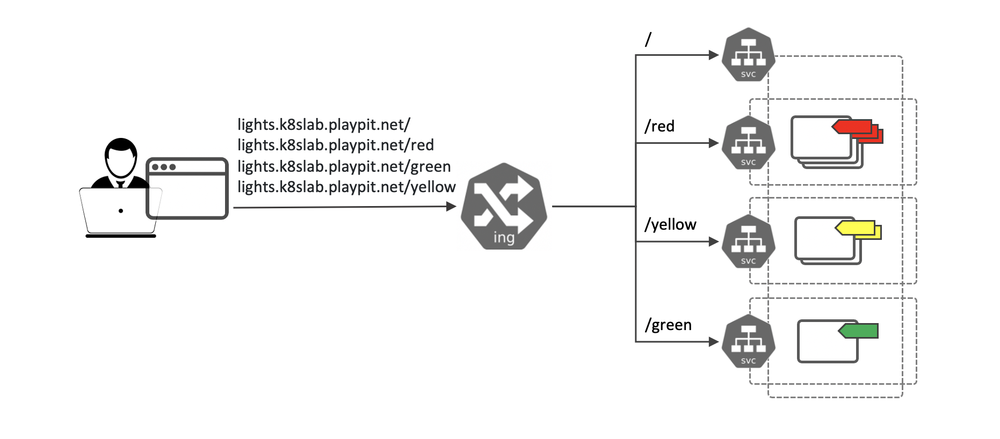

### 4. There’s Food for Thought

#### Task
Let’s create a service from the requirements as below:



**Application** `red-color`

Deployment:

- Name: `red-color`
- Replicas: `3`
- Image: `sbeliakou/color`
- Environment Variables:
    `COLOR=red`

Service:

  - Name: `red-svc`
  - Type: `ClusterIP`
  - Port: `8080`

**Application** `green-color`

Deployment:

  - Name: `green-color`
  - Replicas: `1`
  - Image: `sbeliakou/color`
  - Environment Variables:
      COLOR=`green`

Service:

- Name: `green-svc`
- Type: `ClusterIP`
- Port: `8080`


**Application** `yellow-color`

Deployment:

  - Name: `yellow-color`
  - Replicas: `2`
  - Image: `sbeliakou/color`
  - Environment Variables:
      COLOR=`yellow`

Service:

- Name: `yellow-svc`
- Type: `ClusterIP`
- Port: `8080`

**Service switch**

Service:

- Name: `switch`
- Type: `ClusterIP`
- Port: `80`
- Selected Backends: `red-svc`, `yellow-svc` and `green-svc`

Is it possible?


**Ingress Resource lights-ingress**

- Ingress Name: `lights-ingress`

- FQDN: `lights.k8slab.playpit.net`

- Routing Rules:

  -   `lights.k8slab.playpit.net/ -> switch`
  -   `lights.k8slab.playpit.net/red -> red-svc`
  -   `lights.k8slab.playpit.net/green -> green-svc`
  -   `lights.k8slab.playpit.net/yellow -> yellow-svc
`
**Sollution**
```yaml
apiVersion: apps/v1
kind: Deployment
metadata:
  name: red-color
  labels:
    app: red
spec:
  replicas: 3
  selector:
    matchLabels:
      app: red
  template:
    metadata:
      labels:
        app: red
    spec:
      containers:
      - name: red-container
        image: sbeliakou/color
        env: 
          - name: COLOR    
            value: red
        ports:
          - containerPort: 80  
---
apiVersion: v1
kind: Service
metadata:
  name: red-svc
spec:
  selector:
    app: red
  ports:
    - protocol: TCP
      port: 8080
      targetPort: 80
```

```yaml
apiVersion: networking.k8s.io/v1
kind: Ingress
metadata:
  name: lights-ingress
  annotations:
    nginx.ingress.kubernetes.io/rewrite-target: /
spec:
  rules:
  - host: lights.k8slab.playpit.net 
    http:
      paths:
      - path: /
        pathType: Prefix
        backend:
          service:
            name: switch
            port:
              number: 80
      - path: /red
        pathType: Prefix
        backend:
          service:
            name: red-svc
            port:
              number: 80
      - path: /green
        pathType: Prefix
        backend:
          service:
            name: green-svc
            port:
              number: 80
      - path: /yellow
        pathType: Prefix
        backend:
          service:
            name: yellow-svc
            port:
              number: 80
```

**Documentation:**
- https://kubernetes.io/docs/concepts/workloads/controllers/deployment/
- https://kubernetes.io/docs/concepts/services-networking/service/
https://kubernetes.io/docs/concepts/services-networking/ingress/
