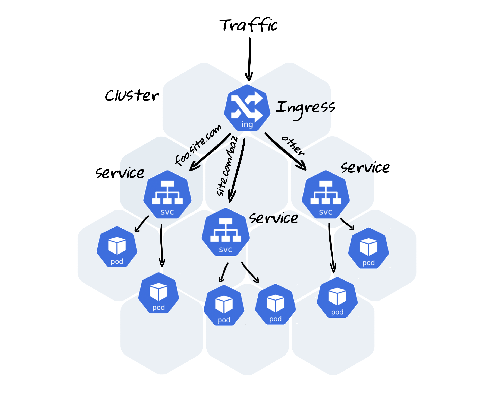

### 5. Ingress Controller

In our stand we use `ingress-nginx` Ingress controller - NGINX based image used as a reverse proxy and load balancer. The goal of this Ingress controller is the assembly of a configuration file (`/etc/nginx/nginx.conf`) from Ingress Resources.

In case of the need for deep troubleshooting it might require to inspect nginx’ configuration.

**Let’s inspect this config file and answer several questions:**

**Q1 What is Nginx Ingress Controller pod name?**

`kubectl get po -n ingress-nginx `

**Q2 What is the value of proxy_connect_timeout for server_name lights.k8slab.playpit.net**

``kubectl exec nginx-ingress-controller-65886f4f5d-v2wqs -n ingress-nginx  more nginx.conf | grep proxy_connect_timeout``

**Q3 what is the value of access_log configuration of “default backend”**
`kubectl exec nginx-ingress-controller-65886f4f5d-v2wqs -n ingress-nginx  more nginx.conf | grep access_log`