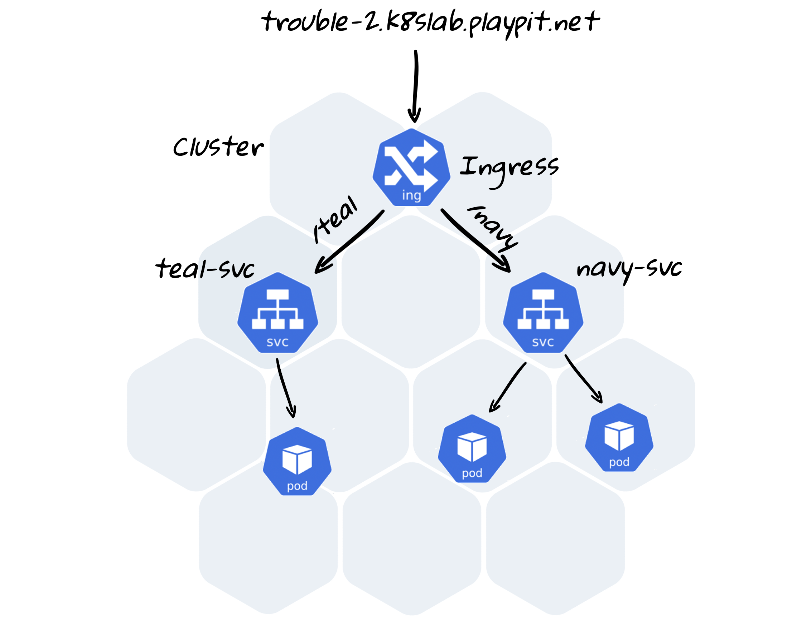

### 7. Troubleshooting. Case 2

#### Task

In namespace `trouble-2` we’ve created two applications, which show html-pages with some colors.

We have two URLs:

- http://trouble-2.k8slab.playpit.net/teal - should show “teal” page
- http://trouble-2.k8slab.playpit.net/navy - should show “navy” page

Something failed during the deployment and now url addresses don’t work as expected.

Please, find the problem and fix it.

**Documentation:**
- https://kubernetes.io/docs/concepts/services-networking/ingress/
- https://cloud.google.com/kubernetes-engine/docs/concepts/ingress
