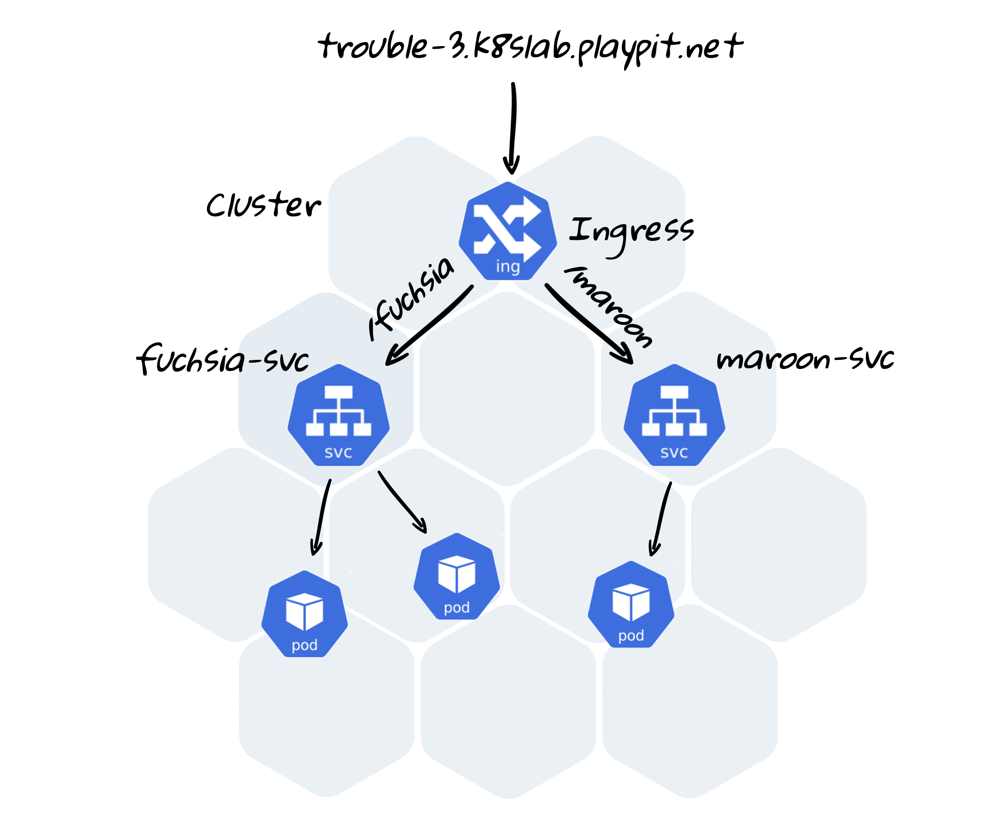

### 8. Troubleshooting. Case 3

#### Task

In namespace `trouble-3` we’ve deployed two applications, which show html-pages with some colors.

**We have two URLs:**

- `http://trouble-3.k8slab.playpit.net/maroon` - should show “maroon” page
- `http://trouble-3.k8slab.playpit.net/fuchsia` - should show “fuchsia” page

Something failed during the deployment and now url addresses doesn’t work as expected.

Please, find the problem and fix it.

**Documentation:**

**Sollution**
1) Changed label in deployment `kubectl edit svc maroon-svc -n trouble-3`
   maroon -> maroon-svc 
2) Changed label in fuchsia-svc `kubectl edit svc fuchsia-svc -n trouble-3`

- https://kubernetes.io/docs/concepts/services-networking/ingress/
- https://cloud.google.com/kubernetes-engine/docs/concepts/ingress
