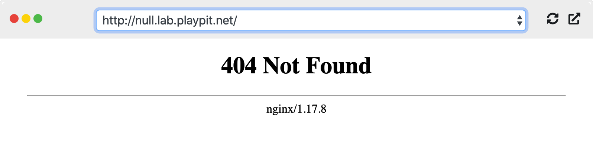
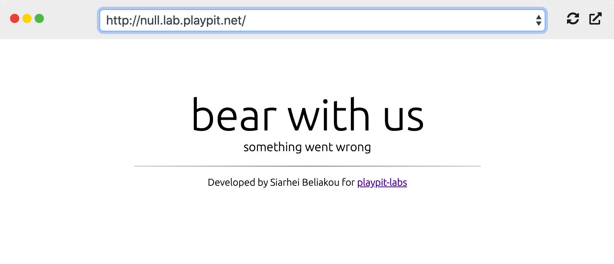

### 9. Setting Up Custom Default Backend

Usually, if Ingress Controller cannot handle requests to the application (due to various errors), it responds with the default error page like below:

#### Let’s customize the default (error) page!

1. Create the custom default-backend:

     - **Namespace:** ingress-default-backend
     - **Deployment Name:** sorry-page
     - **Image:** sbeliakou/http-sorry-page

2. Create a service with the name `sorry-page-service` (downstreams to sorry-page backend):

    - **Namespace:** ingress-default-backend
    - **Service Name:** sorry-page-service
    - **Type:** ClusterIP
    - **Port:** 80

Configure `nginx-ingress-controller` deployment to use our custom error backend (`--default-backend-service`)

**Validation:**

Finally, you will see this page:

