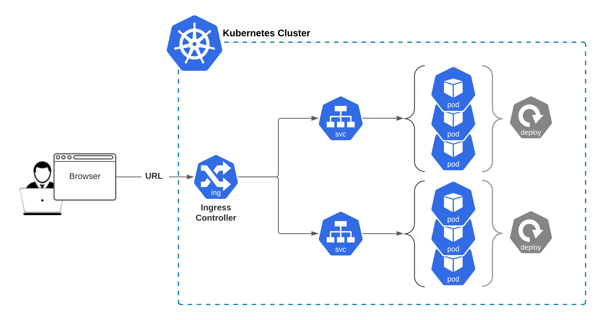

**Ingress Controller is aimed to provide Cluster Level single entry point to internal Deployment/Pods resources**

- This Module is about (at least) following:
- Nginx Ingress Controller
- Application Ingress Resources / Rules
- Default Backend (Maintenace Page)
- Troubleshooting and Fixing!
