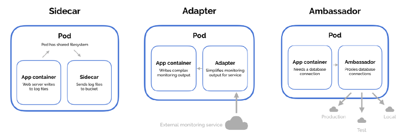
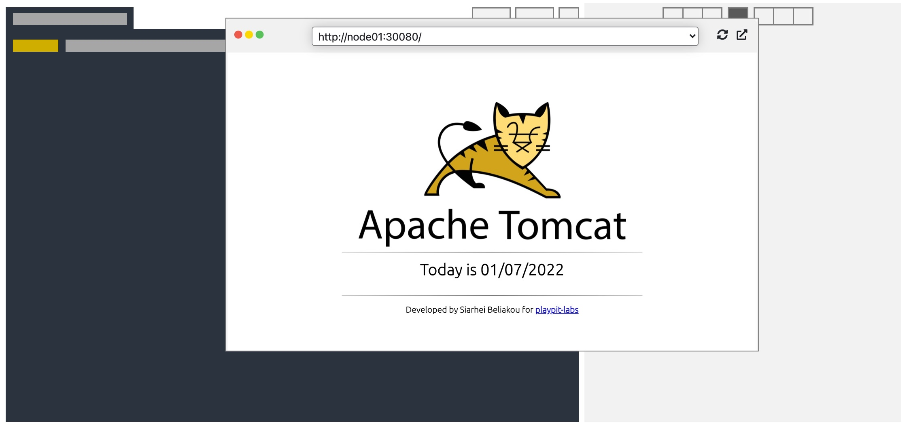
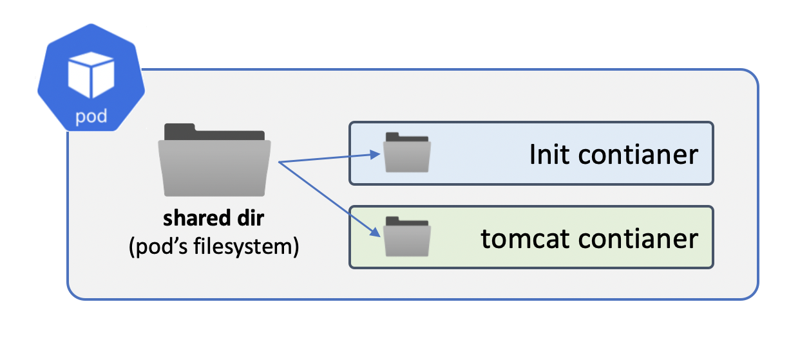
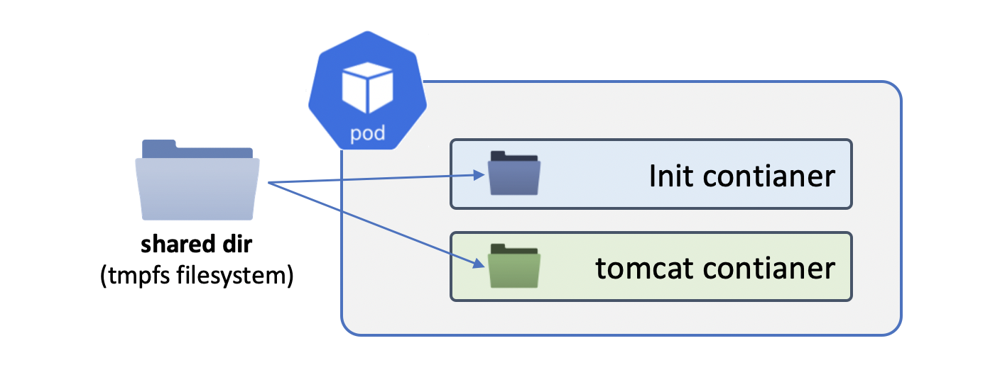

## Working with Volumes I

**Just think about …**

- How does the Pod share data between its containers?
- How to mount a piece of RAM into the Container as a folder?
- How to mount a folder from Worker Node into the Pod’s Container?
- How to run Docker-in-Docker Container in K8s Cluster?

**Covered Topics:**

- emptyDir
- hostPath


### 1. Pod Shared Volume: emptyDir: {}



https://youtu.be/AXi2oENUJHo

On-disk files in a Container are ephemeral, which presents some problems for non-trivial applications when running in Containers. 

1. When a Container crashes, kubelet will restart it, but the files will be lost - the Container starts with a clean state. 

2. When running Containers together in a Pod it is often necessary to share files between those Containers. 

The Kubernetes Volume abstraction solves both of these problems.

An `emptyDir` volume is first created when a Pod is assigned to a Node, and exists as long as that Pod is running on that node. As the name says, it is initially empty. Containers in the Pod can all read and write the same files in the `emptyDir` volume, though that volume can be mounted at the same or different paths in each Container. When a Pod is removed from a node for any reason, the data in the `emptyDir` is deleted forever.

**Example Pod:**

```yaml
apiVersion: v1
kind: Pod
metadata:
  name: test-pd
spec:
  initContainers:
  - image: image1
    name: init-contanier-1
    volumeMounts:
    - mountPath: /dir1
      name: pod-shared-volume

  containers:
  - image: image2
    name: container-a
    volumeMounts:
    - mountPath: /dir2
      name: pod-shared-volume

  - image: image3
    name: container-b
    volumeMounts:
    - mountPath: /dir3
      name: pod-shared-volume

  volumes:
  - name: pod-shared-volume
    emptyDir: {}
```

In this example, all containers (`init-contanier-1`, `container-a`, `container-b`) have access to the same data located inside their pod.

**Task**
We are going to run a pod with Tomcat application, will deploy root’s “server page” before main process starts.


Please, create a Pod with Init and Regular Containers. Share filesystem between containers. Expose pod to NodePort.

**Requirements**

**Pod:**

- **Name:** tomcat-with-init-emptydir
- **Init Container:**
   - Image: `busybox:1.34`
   - command: `wget -O /webapps/ROOT/index.jsp https://playpit-labs-assets.s3-eu-west-1.amazonaws.com/tomcat/index.jsp`
   - Volume Mount Path: /webapps/ROOT/

**Container:**
 - Image: tomcat:9.0-jre8-alpine
 - Volume Mount Path: /usr/local/tomcat/webapps/ROOT

**Volume:**

 - Name: shared-pod-volume
 - type: emptyDir

**Service:**

**Name:** tomcat-with-init-emptydir-svc
**Type:** NodePort
**Target Port:** 8080
**Node Port:** 30080

**Check Your Solution in the Browser:**

**Sollution**

1. `tomcat-pod.yaml`
```yaml
apiVersion: v1
kind: Pod
metadata:
  labels:
    app: tomcat
  name: tomcat-with-init-emptydir
spec:
  initContainers:
  - image: busybox:1.34
    name: tomcatinit
    command: ["/bin/sh", "-c"]
    args: ["wget -O /webapps/ROOT/index.jsp https://playpit-labs-assets.s3-eu-west-1.amazonaws.com/tomcat/index.jsp"]
    volumeMounts:
    - mountPath: /webapps/ROOT/
      name: shared-pod-volume
  containers:
  - image: tomcat:9.0-jre8-alpine
    name: tomcatcontainer
    volumeMounts:
    - mountPath: /usr/local/tomcat/webapps/ROOT
      name: shared-pod-volume
  volumes:
  - name: shared-pod-volume
    emptyDir: {}
```

2. `svc.yaml`

```yaml
apiVersion: v1
kind: Service
metadata:
  name: tomcat-with-init-emptydir-svc
spec:
  selector:
    app: tomcat  
  ports:
    - name: http
      protocol: TCP
      port: 8080
      targetPort: 8080
      nodePort: 30080
  type: NodePort 
```



Documentation
https://kubernetes.io/docs/concepts/storage/volumes/#emptydir


## 2. Pod Shared Volume: emptyDir: {}




Here’s a little bit tricky task.

Please run a pod with custom details. Using initContainer you should compose an index.html with custom data.

**Requirements:**


**Pod:**

Name: web-tricky-pod-emptydir
Shared Volume:
Type: emptyDir
Name: shared-pod-volume
Init Container (initiates index.html file at Pod starts):

Image: busybox:1.34
Command: simple shell script which creates an index.html page, for example:


**Sollution:**

1. `pod.yaml`

```yaml
apiVersion: v1
kind: Pod
metadata:
  creationTimestamp: null
  labels:
    app: web
  name: web-tricky-pod-emptydir
spec:
  initContainers:
  - image: busybox:1.34
    command: ["sh", "-c"]
    args: ["touch /html/index.html"]
    name: web-tricky-pod-emptydir
    volumeMounts:
    - mountPath: /html/
      name: shared-pod-volume
  containers:
  - image: nginx:alpine
    name: nginxcontainer
    volumeMounts:
    - mountPath: /html/
      name: shared-pod-volume
  volumes:
  - name: shared-pod-volume
    emptyDir: {}
```
2. `svc.yaml`

```yaml
apiVersion: v1
kind: Service
metadata:
  name: tomcat-with-init-emptydir-svc
spec:
  selector:
    app: tomcat  
  ports:
    - name: http
      protocol: TCP
      port: 8080
      targetPort: 8080
      nodePort: 30080
  type: NodePort 
```


## 3. Pod Shared Volume: Memory


By default, `emptyDir` volumes are stored on whatever medium is backing the node - that might be disk or SSD or network storage, depending on your environment. However, you can set the `emptyDir.medium` field to `Memory` to tell Kubernetes to mount a tmpfs (RAM-backed filesystem) for you instead. While `tmpfs` is very fast, be aware that unlike disks, tmpfs is cleared on a node reboot, and any files you write will count against your Container’s memory limit.
```yaml
  ...
  volumes:
  - name: pod-shared-volume-ram
    emptyDir:
      medium: Memory
```


**Task**

Create a Pod with Init and Regular Containers. Share in-pod filesystem bettween them.

**Requirements**

Pod:

Pod Name: web-pod-emptydir-tmpfs
Shared Storage:
Type: emptyDir
Medium: Memory
Init Container:
Image: busybox:1.34
Command: echo "initialized by initContainer, using tmpfs" > /html/index.html
Volume Mount Path: /html
Container:
Image: nginx:alpine
Volume Mount Path: /usr/share/nginx/html
Type: emptyDir
Medium: Memory
Volume Name: shared-pod-volume
Service:

Name: web-pod-emptydir-tmpfs-svc
Type: NodePort
Target Port: 80
Node Port: 30082


Verify:
# kubectl exec web-pod-emptydir-tmpfs -- mount | grep /usr/share/nginx/html
tmpfs on /usr/share/nginx/html type tmpfs (rw,relatime)
# curl master:30082
initialized by initContainer, using tmpfs
# curl node01:30082
initialized by initContainer, using tmpfs
# curl node02:30082
initialized by initContainer, using tmpfs
# curl -IL node02:30082
HTTP/1.1 200 OK
Server: nginx/1.21.5
Date: Fri, 07 Jan 2022 18:23:35 GMT
Content-Type: text/html
Content-Length: 42
Last-Modified: Fri, 07 Jan 2022 18:19:56 GMT
Connection: keep-alive
ETag: "61d8844c-2a"
Accept-Ranges: bytes

**Sollution**


1. `webpod.yaml`
```yaml
apiVersion: v1
kind: Pod
metadata:
  labels:
    app: webpod
  name: web-pod-emptydir-tmpfs
spec:
  containers:
  - image: nginx:alpine
    name: webcontainer
    volumeMounts:
    - mountPath: /usr/share/nginx/html
      name: shared-pod-volume
  initContainers:
  - image: busybox:1.34
    name: initcontainerweb
    command: ["sh", "-c"]
    args: ["echo \"initialized by initContainer, using tmpfs\" > /html/index.html "]
    volumeMounts:
    - mountPath: /html
      name: shared-pod-volume

  volumes:
  - name: shared-pod-volume
    emptyDir:
      medium: Memory
```

2. `websvc.yaml`
```yaml
apiVersion: v1
kind: Service
metadata:
  name: web-pod-emptydir-tmpfs-svc
spec:
  selector:
    app: webpod
  ports:
  - name: http
    protocol: TCP
    port: 80
    targetPort: 80
    nodePort: 30082
  type: NodePort
```


Documentation
https://kubernetes.io/docs/concepts/storage/volumes/#emptydir

## 4. Running Docker inside Kubernetes’ Pod

We will try to run docker container inside Kubernetes

Task
Let’s try to create a pod with docker:dind image.

docker run --privileged -d \
    --tmpfs /var/lib/docker \
    docker:dind
Here, we use tmpfs just for speeding up Docker engine

Verify:
Check if docker pod is running

$ kubectl get pods -o custom-columns="POD:.metadata.name,IMAGE:.spec.containers[*].image,STATUS:.status.phase"
POD      IMAGE         STATUS
docker   docker:dind   Running
Check if all good with docker daemon

$ kubectl exec -it docker -- sh
/ # docker ps
CONTAINER ID   IMAGE     COMMAND   CREATED   STATUS    PORTS     NAMES
/ # docker run hello-world
Unable to find image 'hello-world:latest' locally
latest: Pulling from library/hello-world
2db29710123e: Pull complete 
Digest: sha256:37a0b92b08d4919615c3ee023f7ddb068d12b8387475d64c622ac30f45c29c51
Status: Downloaded newer image for hello-world:latest

Hello from Docker!
This message shows that your installation appears to be working correctly.
...

**Sollution**
`docker-pod.yaml`

```yaml
apiVersion: v1
kind: Pod
metadata:
  labels:
    run: docker
  name: docker
spec:
  containers:
  - image: docker:dind
    name: docker
    securityContext:
       privileged: true
    volumeMounts:
    - mountPath: /var/lib/docker
      name: cache-volume
  volumes:
  - name: cache-volume
    emptyDir:
      medium: Memory
```

Documentation
https://kubernetes.io/docs/concepts/storage/volumes/#emptydir
https://kubernetes.io/docs/tasks/configure-pod-container/security-context/#set-the-security-context-for-a-pod
https://kubernetes.io/docs/concepts/policy/pod-security-policy/#privileged
https://snyk.io/blog/10-kubernetes-security-context-settings-you-should-understand/


## 5. Mounting Data from Node: hostPath

A hostPath volume mounts a file or directory from the host node’s filesystem into your Pod. This is not something that most Pods will need, but it offers a powerful escape hatch for some applications.

For example, some uses for a hostPath are:

running a Container that needs access to Docker internals; use a hostPath of /var/lib/docker
running cAdvisor in a Container; use a hostPath of /sys
allowing a Pod to specify whether a given hostPath should exist prior to the Pod running, whether it should be created, and what it should exist as
Example Pod:


apiVersion: v1
kind: Pod
metadata:
  name: test-pd
spec:
  containers:
  - image: k8s.gcr.io/test-webserver
    name: test-container
    volumeMounts:
    - mountPath: /test-pd
      name: test-volume
  volumes:
  - name: test-volume
    hostPath:
      path: /data              # directory location on host
      type: DirectoryOrCreate  # this field is optional


Defining a Node where to run a workload
You can constrain a Pod to only be able to run on particular Node(s), or to prefer to run on particular nodes.
There are several ways to do this:

1. Node Name
Please find more details here:

https://kubernetes.io/docs/concepts/configuration/assign-pod-node/#nodename
apiVersion: v1
kind: Pod
...
spec:
  nodeName: node01
  containers: ...
2. Node Selector
Please find more details here:

https://kubernetes.io/docs/concepts/configuration/assign-pod-node/#nodeselector
https://kubernetes.io/docs/concepts/configuration/assign-pod-node/#built-in-node-labels
apiVersion: v1
kind: Pod
...
spec:
  nodeSelector:
    kubernetes.io/hostname: node01
  containers: ...
3. Node Affinity
Please find more details here:

https://kubernetes.io/docs/concepts/configuration/assign-pod-node/#node-affinity
apiVersion: v1
kind: Pod
...
spec:
  affinity:
    nodeAffinity:
      requiredDuringSchedulingIgnoredDuringExecution:
        nodeSelectorTerms:
        - matchExpressions:
          - key: kubernetes.io/hostname
            operator: In
            values:
            - node01
  containers: ...
Task:
We have a static site. Its content placed under /host-data folder on node01. Please create a microservice application with volume mount from host location. You will see working site inside a browser here.

Requirements:
Deployment:

Name: web-deployment-hostpath
 Set pod to run on node01!
Image: nginx:alpine
Replicas: 1
Volume:
hostPath: /host-data (on node01)
mount point: /usr/share/nginx/html
Service:

Name: web-deployment-hostpath-svc
Type: NodePort
NodePort: 30083

**Sollution**

1. `web deploy`

```yaml
apiVersion: apps/v1
kind: Deployment
metadata:
  labels:
    app: webdevelopmenthostpath
  name: web-deployment-hostpath
spec:
  replicas: 1
  selector:
    matchLabels:
      app: webdevelopmenthostpath
  template:
    metadata:
      labels:
        app: webdevelopmenthostpath
    spec:
      affinity:
          nodeAffinity:
            requiredDuringSchedulingIgnoredDuringExecution:
              nodeSelectorTerms:
              - matchExpressions:
                - key: kubernetes.io/hostname
                  operator: In
                  values:
                  - node01
      containers:
        - image: nginx:alpine
          name: nginxcontainer
          volumeMounts:
          - mountPath: /usr/share/nginx/html
            name: shared-node-vol
      volumes:
      - name: shared-node-vol
        hostPath:
          path: /host-data
          type: DirectoryOrCreate
```
2. `web svc.yaml`

```yaml
apiVersion: v1
kind: Service
metadata:
  name: web-deployment-hostpath-svc
spec:
  selector:
    app: webdevelopmenthostpath
  ports:
  - name: http
    protocol: TCP
    port: 80
    targetPort: 80
    nodePort: 30083
  type: NodePort
```

Documentation:
https://kubernetes.io/docs/concepts/storage/volumes/#hostpath
https://kubernetes.io/docs/concepts/configuration/assign-pod-node/#nodename
https://kubernetes.io/docs/concepts/configuration/assign-pod-node/#nodeselector
https://kubernetes.io/docs/concepts/configuration/assign-pod-node/#built-in-node-labels
