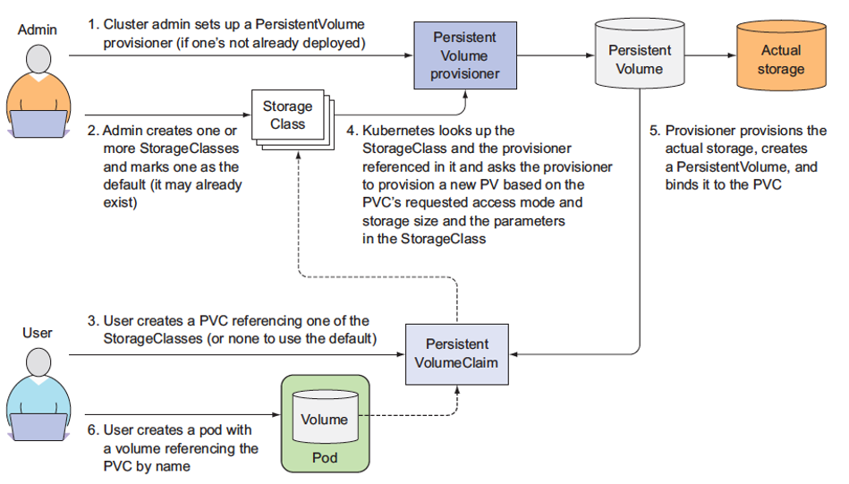

## 1. Persistent Volumes



The PersistentVolume subsystem provides an API for users and administrators that abstracts details of how storage is provided from how it is consumed. To do this, we introduce two new API resources: `PersistentVolume` and `PersistentVolumeClaim`.

### A PersistentVolume (PV):
is a piece of storage in the cluster that has been provisioned by an administrator or dynamically provisioned using Storage Classes. It is a resource in the cluster just like a node is a cluster resource. PVs are volume plugins like Volumes, but have a lifecycle independent of any individual Pod that uses the PV. This API object captures the details of the implementation of the storage, be that NFS, iSCSI, or a cloud-provider-specific storage system.

### A PersistentVolumeClaim (PVC):
It’s a request for storage by a user. It is similar to a Pod. Pods consume node resources and PVCs consume PV resources. Pods can request specific levels of resources (CPU and Memory). Claims can request specific size and access modes (e.g., they can be mounted once read/write or many times read-only).

While PersistentVolumeClaims allow a user to consume abstract storage resources, it is common that users need PersistentVolumes with varying properties, such as performance, for different problems. Cluster administrators need to be able to offer a variety of PersistentVolumes that differ in more ways than just size and access modes, without exposing users to the details of how those volumes are implemented. For these needs, there is the StorageClass resource.

PV & PVC Explained:

https://youtu.be/hAhoeg3RryY

https://youtu.be/x2sMWUkasoE

### Relation Diagram:


**Using commands as below, please answer the quiestions:**
```yaml
kubectl get pv
kubectl get pv <<pv name>> -o yaml
kubectl describe pv <<pv name>>
```

Documentation:

https://kubernetes.io/docs/concepts/storage/persistent-volumes/

https://kubernetes.io/docs/concepts/storage/persistent-volumes/#reclaiming

https://kubernetes.io/docs/concepts/storage/persistent-volumes/#access-modes

https://www.learnitguide.net/2020/03/kubernetes-persistent-volumes-and-claims.html


**Quiz**

Q1 How many PVs are currently available in th Cluster?

Q2 What is pv2 capacity (allowed size)?

Q3 What is pv3 Access Mode?

Q4 What is the reclaim policy used for pv4?

Q5 What is pv1 status?

Q6 What is pv2 status?

Q7 What is pv3 status?

Q8 What is pv4 status?


1. `pv1.yaml`
```yaml
apiVersion: v1
kind: PersistentVolume
metadata:
  finalizers:
  - kubernetes.io/pv-protection
  labels:
    disk: hdd
  name: pv1
  resourceVersion: "1841"
  uid: e5c63dc5-0cb9-462e-9e66-6ad1c3148ff4
spec:
  accessModes:
  - ReadOnlyMany
  capacity:
    storage: 20Mi
  claimRef:
    apiVersion: v1
    kind: PersistentVolumeClaim
    name: pv1-claim
    namespace: default
    uid: 4225fd88-6e48-4e09-9f5a-c910cc391209
  local:
    path: /data/pv1
  nodeAffinity:
    required:
      nodeSelectorTerms:
      - matchExpressions:
        - key: kubernetes.io/hostname
          operator: In
          values:
          - node01
  persistentVolumeReclaimPolicy: Retain
  volumeMode: Filesystem
status:
  phase: Released
```

2. `pv2.yaml`
```yaml
apiVersion: v1
kind: PersistentVolume
metadata:
  finalizers:
  - kubernetes.io/pv-protection
  labels:
    disk: hdd
  name: pv2
  resourceVersion: "1844"
  uid: 278b8ed5-34d0-4d48-aff3-a04a039ca9bd
spec:
  accessModes:
  - ReadWriteOnce
  capacity:
    storage: 50Mi
  claimRef:
    apiVersion: v1
    kind: PersistentVolumeClaim
    name: pv2-claim
    namespace: default
    uid: d94144b5-dbbd-429b-b075-e326a3aaf230
  local:
    path: /data/pv2
  nodeAffinity:
    required:
      nodeSelectorTerms:
      - matchExpressions:
        - key: kubernetes.io/hostname
          operator: In
          values:
          - node02
  persistentVolumeReclaimPolicy: Recycle
  volumeMode: Filesystem
status:
  phase: Bound
```
1. `pvc.yaml`
```yaml
apiVersion: v1
kind: PersistentVolumeClaim
metadata:
  finalizers:
  - kubernetes.io/pvc-protection
  name: pv2-claim
  namespace: default
  resourceVersion: "1873"
  uid: d94144b5-dbbd-429b-b075-e326a3aaf230
spec:
  accessModes:
  - ReadWriteOnce
  resources:
    requests:
      storage: 38Mi
  selector:
    matchLabels:
      disk: hdd
  storageClassName: ""
  volumeMode: Filesystem
  volumeName: pv2
status:
  accessModes:
  - ReadWriteOnce
  capacity:
    storage: 50Mi
  phase: Bound
```
```yaml
apiVersion: v1
kind: PersistentVolume
metadata:
  annotations:
  finalizers:
  - kubernetes.io/pv-protection
  labels:
    disk: ssd
  name: pv3
  resourceVersion: "1855"
  uid: 1da5ea67-dffc-4f62-bf55-7c9b0c9c26cd
spec:
  accessModes:
  - ReadWriteMany
  capacity:
    storage: 60Mi
  claimRef:
    apiVersion: v1
    kind: PersistentVolumeClaim
    name: pv3-claim
    namespace: default
    uid: 5e6be866-675c-49a9-96d6-153d368e54c9
  local:
    path: /data/pv3
  nodeAffinity:
    required:
      nodeSelectorTerms:
      - matchExpressions:
        - key: kubernetes.io/hostname
          operator: In
          values:
          - master
  persistentVolumeReclaimPolicy: Recycle
  volumeMode: Filesystem
status:
  message: No recycler plugin found for the volume!
  phase: Failed
```

```yaml
apiVersion: v1
kind: PersistentVolume
metadata:
  finalizers:
  - kubernetes.io/pv-protection
  name: pv4
  resourceVersion: "1859"
  uid: 38104aa8-183c-4e79-a49c-68506686b109
spec:
  accessModes:
  - ReadWriteMany
  capacity:
    storage: 70Mi
  local:
    path: /data/pv4
  nodeAffinity:
    required:
      nodeSelectorTerms:
      - matchExpressions:
        - key: kubernetes.io/hostname
          operator: In
          values:
          - master
  persistentVolumeReclaimPolicy: Delete
  volumeMode: Filesystem
status:
  phase: Available
```