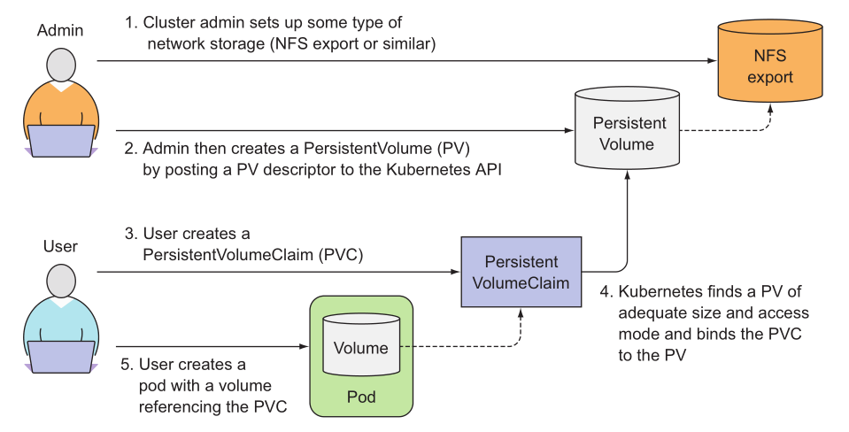

## 3. Persistent Volume Claims

**A PersistentVolumeClaim (PVC):**

It is a request for storage by a user. It is similar to a Pod. Pods consume node resources and PVCs consume PV resources. Pods can request specific levels of resources (CPU and Memory). Claims can request specific size and access modes (e.g., they can be mounted once read/write or many times read-only).

While PersistentVolumeClaims allow a user to consume abstract storage resources, it is common that users need PersistentVolumes with varying properties, such as performance, for different problems. Cluster administrators need to be able to offer a variety of PersistentVolumes that differ in more ways than just size and access modes, without exposing users to the details of how those volumes are implemented. For these needs, there is the StorageClass resource.

Task:
Please investigate skodirov-data-pv and create persistent volume claim (skodirov-data-pv-claim) for it

Requirements:
PVC Name: skodirov-data-pv-claim
Status: Bound
Documentation:
https://kubernetes.io/docs/concepts/storage/persistent-volumes/
https://kubernetes.io/docs/concepts/storage/persistent-volumes/#persistentvolumeclaims
https://kubernetes.io/docs/concepts/storage/persistent-volumes/#persistent-volume-claim-requesting-a-raw-block-volume
https://kubernetes.io/docs/tasks/configure-pod-container/configure-persistent-volume-storage/#create-a-persistentvolumeclaim
